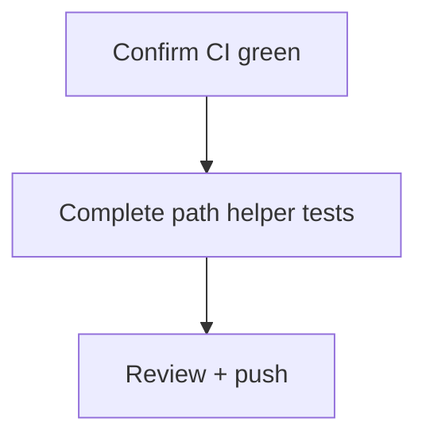

# LFG PR #44 — merge gate

## Objective

Confirm [#44](https://github.com/bolabaden/AgentDecompile/pull/44) at `869aed2` has all merge-blocking CI green and no regressions; close any last test gap for `resolve_domain_program_path`; mark PR ready to merge.

## Flow



## Requirements

| ID | Requirement | Verification |
|----|-------------|--------------|
| R1 | Unit, Headless, Ghidra extension SUCCESS on HEAD | `gh pr checks 44` |
| R2 | Local 64+ unit tests pass | `pytest -m unit` |
| R3 | `resolve_domain_program_path(None fallback)` covered | Unit test |
| R4 | Residual doc HEAD `869aed2` | Residual file |

## Implementation units

### IU1 — Test `fallback_path=None` edge case

- File: `tests/test_tool_providers_analysis_gate.py`

### IU2 — Residual + local verify

- Pin HEAD; run full unit + not-e2e locally.

## Verification

```bash
uv run pytest -m unit -q --timeout=120
gh pr checks 44
```
