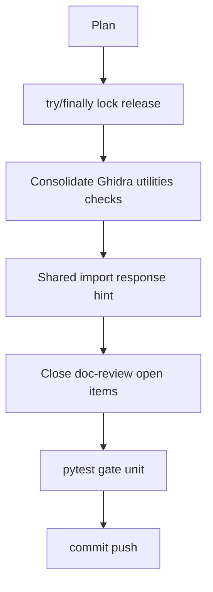

# LFG PR #44 — merge-ready hardening

## Objective

Finalize [#44](https://github.com/bolabaden/AgentDecompile/pull/44) for merge: exception-safe lock cleanup, maintainability in `program_analysis.py`, clarify shared-import `analyzeAfterImport=false` responses, close stale doc-review items.

## Flow



## Requirements traceability

| ID | Requirement | Verification |
|----|-------------|--------------|
| R1 | Locks released on analysis exceptions | `try`/`finally` around locked sections |
| R2 | Single Ghidra utilities helper | `_ghidra_utilities_pending()` used by needs/running |
| R3 | Shared import documents deferred in-session ensure | `inSessionAnalysisPending` in success payload when `analyzeAfterImport=false` |
| R4 | Doc-review findings reflect merged fixes | Update `docs/doc-review-findings/2026-05-24-blocking-program-analysis-gate.md` |
| R5 | Tests pass | Gate unit pytest |

## Out of scope

- Full LFG e2e (Ghidra Server in CI)
- Changing workflow branch filters (`main` vs `master`)

## Verification

```bash
uv run pytest tests/test_program_analysis_gate.py tests/test_tool_providers_analysis_gate.py -m unit -q
```
