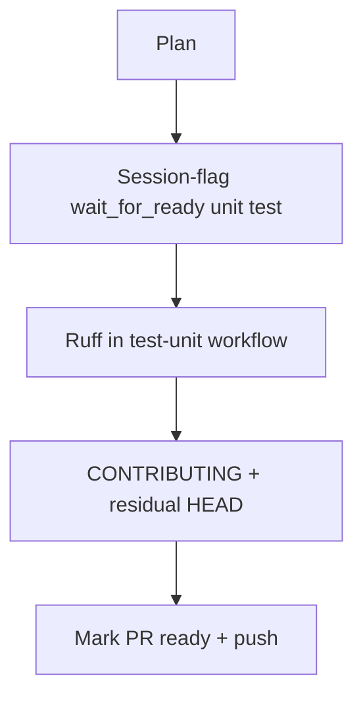

# LFG PR #44 — ready for review and CI lint

## Objective

Finalize [#44](https://github.com/bolabaden/AgentDecompile/pull/44) on `impl/blocking-analysis-gate-c2bc`: add session-flag fast-path test coverage, run **ruff** in unit CI, document `git add -f` for tracked CLI sources, mark the draft PR ready for review, commit, and push.

## Flow



## Requirements traceability

| ID | Requirement | Verification |
|----|-------------|--------------|
| R1 | `wait_for_program_analysis_ready` returns without idle when session `ghidra_analysis_complete` and Ghidra agrees | New unit test |
| R2 | PR CI runs ruff on `src/` and `tests/` | `test-unit.yml` step |
| R3 | Contributors know to `git add -f` for `src/agentdecompile_cli/` | `CONTRIBUTING.md` |
| R4 | PR #44 marked ready; branch pushed | `gh pr ready` + `git push` |
| R5 | No regressions | `pytest -m unit -q` |

## Out of scope

- Live Ghidra `/lfg` e2e (P3 downstream)
- CLI agent-help plan (separate branch after merge)

## Verification

```bash
uv run pytest tests/test_program_analysis_gate.py -m unit -q
uv run pytest -m unit -q --timeout=120
uv run ruff check --no-fix src/ tests/
```
