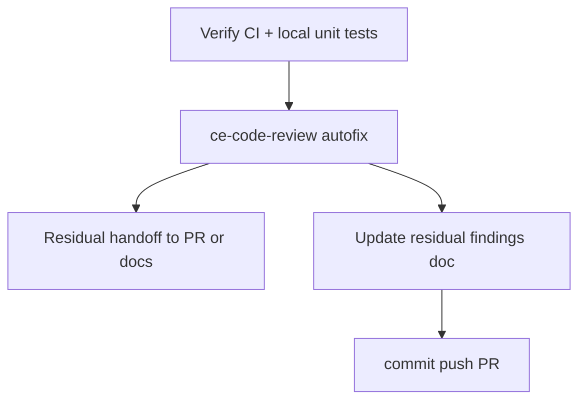

# LFG PR #44 — ship pass (CI green, review, PR)

## Objective

Close the LFG pipeline for [#44](https://github.com/bolabaden/AgentDecompile/pull/44): confirm required CI is green after headless/Python fixes, run code review autofix, persist residuals, update durable docs, and ensure branch is pushed with PR ready for merge.

## Flow



## Requirements traceability

| ID | Requirement | Verification |
|----|-------------|--------------|
| R1 | Headless + unit + Ghidra smoke workflows succeed on HEAD | GitHub checks on PR #44 |
| R2 | Local unit suite passes | `uv run pytest -m unit -q --timeout=120` |
| R3 | Residual review findings recorded on PR or `docs/residual-review-findings/` | PR body or fallback file |
| R4 | `docs/residual-review-findings/impl-blocking-analysis-gate-c2bc.md` reflects green CI | File content |

## Scope boundaries

- **In scope:** Documentation, review autofixes, PR metadata, residual recording.
- **Out of scope:** Post-merge LFG e2e (`pytest -m lfg`), publish-ghidra Gradle cleanup, Docker aio build flakes.

## Implementation units

### IU1 — Verify green CI and local tests

- Confirm PR check rollup: unit, headless matrix, test-ghidra all SUCCESS.
- Run `uv run pytest -m unit -q --timeout=120` and `uv run ruff check --no-fix src/ tests/`.

### IU2 — Update residual findings doc

- File: `docs/residual-review-findings/impl-blocking-analysis-gate-c2bc.md`
- Note HEAD SHA, green CI matrix, commits `8a827ba` (Python 3.12), `0564dca` (headless scope + stub gate).

### IU3 — Review and ship

- Run `ce-code-review` with plan path; commit any autofixes.
- Record residuals; `ce-commit-push-pr` if needed.

## Test scenarios

| Scenario | Expected |
|----------|----------|
| Unit CI | `pytest -m unit` job SUCCESS |
| Headless CI | Four matrix jobs SUCCESS with `-m "not e2e"` |
| Stub program gate | `test_program_needs_analysis_false_for_stub_without_analysis_state` passes |
| Manager parity tests | `test_tool_provider_manager_*` complete without timeout |

## Verification

```bash
uv run ruff check --no-fix src/ tests/
uv run pytest -m unit -q --timeout=120
uv run pytest tests/ -m "not e2e" -q --timeout=120
gh pr checks 44
```
