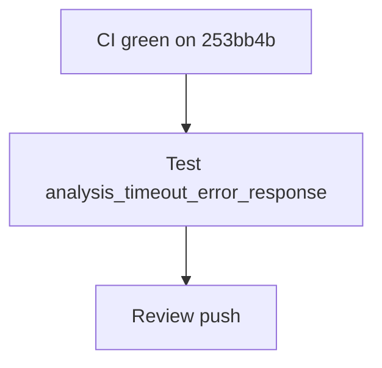

# LFG PR #44 — ship complete

## Objective

Final `/lfg` confirmation for [#44](https://github.com/bolabaden/AgentDecompile/pull/44): CI green on `253bb4b`, add unit test for `analysis_timeout_error_response` JSON contract, pin residual HEAD, push.

## Flow



## Requirements

| ID | Requirement | Verification |
|----|-------------|--------------|
| R1 | All merge-blocking CI SUCCESS on `253bb4b` | `gh pr checks 44` |
| R2 | 65+ unit tests pass | `pytest -m unit` |
| R3 | `analysis_timeout_error_response` JSON shape tested | New unit test |
| R4 | Residual HEAD `253bb4b` | Residual file |

## Implementation units

### IU1 — Unit test `analysis_timeout_error_response`

- File: `tests/test_tool_providers_analysis_gate.py`
- Assert `state: analysis-timeout`, `programPath`, `success: false`.

### IU2 — Residual doc

- Pin HEAD `253bb4b`; note CI green.

## Verification

```bash
uv run pytest tests/test_tool_providers_analysis_gate.py -m unit -q
```
