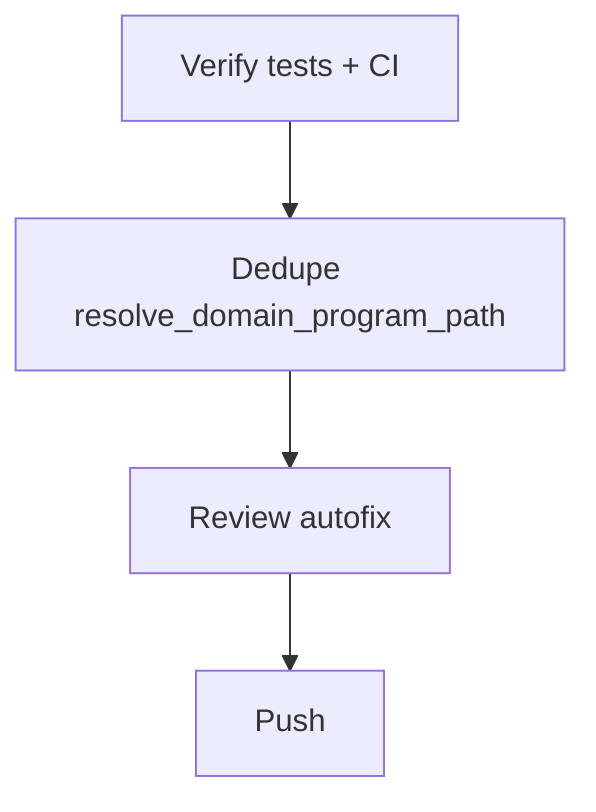

# LFG PR #44 — ship

## Objective

Final `/lfg` on [#44](https://github.com/bolabaden/AgentDecompile/pull/44) at `60ca6d2`: confirm CI green, dedupe duplicated domain program-path resolution in `tool_providers.py`, sync residual doc, review, push.

## Flow



## Requirements

| ID | Requirement | Verification |
|----|-------------|--------------|
| R1 | Merge-blocking CI green on HEAD | `gh pr checks 44` |
| R2 | Unit + not-e2e pass locally | pytest |
| R3 | Single helper for domain program path | `tool_providers.py` |
| R4 | Residual doc HEAD updated | `docs/residual-review-findings/impl-blocking-analysis-gate-c2bc.md` |

## Implementation units

### IU1 — `resolve_domain_program_path` helper

- File: `src/agentdecompile_cli/mcp_server/tool_providers.py`
- Use for gate wait and provider timeout paths.

### IU2 — Verify + residual doc

- Sync HEAD; note all workflows green on `60ca6d2`.

## Verification

```bash
uv run pytest tests/test_tool_providers_analysis_gate.py -m unit -q
uv run pytest -m unit -q --timeout=120
```
