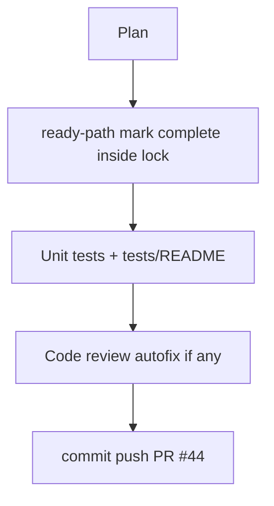

# LFG PR #44 — ship ready-path fast exit and push

## Objective

Commit and push the remaining gate dispatch/ready-path optimization on `impl/blocking-analysis-gate-c2bc`, verify unit tests, and leave PR [#44](https://github.com/bolabaden/AgentDecompile/pull/44) merge-ready.

## Flow



## Requirements traceability

| ID | Requirement | Verification |
|----|-------------|--------------|
| R1 | `wait_for_program_analysis_ready` marks session complete and returns without idle wait when Ghidra already analyzed (inside lock) | `tests/test_program_analysis_gate.py` |
| R2 | Document gate test commands in `tests/README.md` | Doc section |
| R3 | Residual doc lists PR #44 verification commands | `docs/residual-review-findings/impl-blocking-analysis-gate-c2bc.md` |
| R4 | All unit tests pass | `pytest -m unit -q --timeout=120` |

## Files

- `src/agentdecompile_cli/mcp_utils/program_analysis.py`
- `tests/test_program_analysis_gate.py`
- `tests/README.md`
- `docs/residual-review-findings/impl-blocking-analysis-gate-c2bc.md`

## Out of scope

- Full `/lfg` e2e with live Ghidra Server (P3 downstream)
- Browser/UI tests (no web surface)

## Verification

```bash
uv run pytest tests/test_program_analysis_gate.py tests/test_tool_providers_analysis_gate.py -m unit -q
uv run pytest -m unit -q --timeout=120
```
