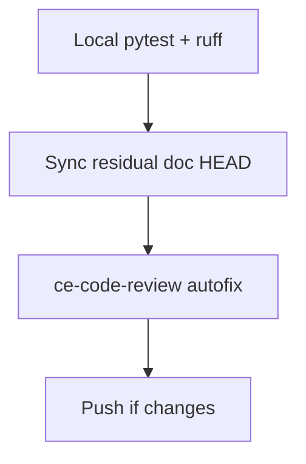

# LFG PR #44 — verify merge-ready

## Objective

Re-run `/lfg` on [#44](https://github.com/bolabaden/AgentDecompile/pull/44) at `55abe1d`: confirm all merge-blocking CI is green, sync residual doc to current HEAD, pass review autofix gate, push.

## Flow



## Requirements traceability

| ID | Requirement | Verification |
|----|-------------|--------------|
| R1 | Unit, Headless, Ghidra extension workflows SUCCESS | `gh pr checks 44` / `gh run list` |
| R2 | Local `pytest -m unit` and `-m "not e2e"` pass | Local run |
| R3 | Residual doc HEAD matches branch tip | `docs/residual-review-findings/impl-blocking-analysis-gate-c2bc.md` |
| R4 | Review autofixes committed if any | `git log` |

## Scope boundaries

- **In scope:** Verification, residual doc, review pass, push.
- **Out of scope:** Docker arm64/aio pending jobs, `_version.py`, post-merge `pytest -m lfg`.

## Implementation units

### IU1 — Verify CI and local tests

Run `uv run ruff check --no-fix src/ tests/`, `uv run pytest -m unit -q --timeout=120`, `uv run pytest tests/ -m "not e2e" -q --timeout=120`.

Confirm GitHub: `pytest -m unit`, `Test Headless Mode`, `Test Ghidra Extension` all pass on latest push.

### IU2 — Sync residual findings doc

- File: `docs/residual-review-findings/impl-blocking-analysis-gate-c2bc.md`
- Set HEAD to `55abe1d`; note docs-only follow-up commit after `88a9c3e`.

### IU3 — Review and ship

- `ce-code-review` with this plan path.
- Commit/push any autofixes; ensure branch up to date with origin.

## Test scenarios

| Scenario | Expected |
|----------|----------|
| Fail-closed after ensure | `test_blocking_ensure_raises_when_still_needs_after_run` passes |
| Incomplete analysis MCP error | `test_analysis_incomplete_returns_structured_error` passes |
| Stub without getAnalysisState | Gate skip tests pass |

## Verification

```bash
uv run pytest -m unit -q --timeout=120
gh pr checks 44
```
