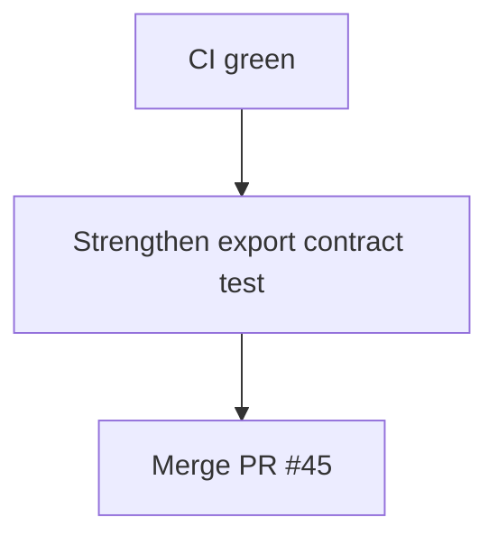

# LFG PR #45 — ship post-merge closeout

## Objective

Complete `/lfg` for [#45](https://github.com/bolabaden/AgentDecompile/pull/45): CI green on `359d903`, tighten `__all__` export test, merge to `master`.

## Flow



## Requirements

| ID | Requirement | Verification |
|----|-------------|--------------|
| R1 | CI SUCCESS | `gh pr checks 45` |
| R2 | 68 unit tests local | `pytest -m unit` |
| R3 | `__all__` matches public callables | Unit test |
| R4 | PR #45 merged | `gh pr view 45` |

## Implementation units

### IU1 — Strengthen export test

- Assert every non-private module-level name in `__all__` is the complete public surface (functions + `ProgramAnalysisTimeout`).

### IU2 — Merge PR #45 when green

## Verification

```bash
uv run pytest tests/test_program_analysis_gate.py -m unit -q
```
