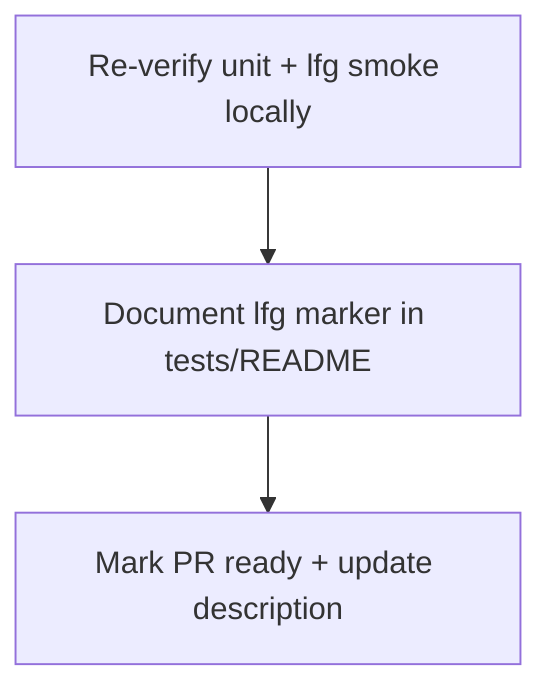

# LFG — ship PR #46

## Objective

PR [#46](https://github.com/bolabaden/AgentDecompile/pull/46) implements `tests/test_lfg_e2e.py` and residual doc updates; **CI is green**. Finish the LFG pass: document the `lfg` marker for contributors, mark the PR ready for review, and push any doc-only follow-ups.

## Flow



## Requirements

| ID | Requirement | Verification |
|----|-------------|--------------|
| R1 | `tests/README.md` documents `test_lfg_e2e.py`, `@pytest.mark.lfg`, and `LFG_RUN=1` | File contains lfg section |
| R2 | Local tests pass | `pytest tests/test_lfg_e2e.py -m "not lfg"` and `-m unit` |
| R3 | PR #46 marked ready (not draft) | `gh pr view 46 --json isDraft` |
| R4 | Branch pushed with doc commit | `git push` |

## Scope boundaries

- **In scope:** Contributor docs, PR readiness.
- **Out of scope:** Squash-merge (human/auto-merge policy); full `LFG_RUN=1` driver in cloud VM.

## Implementation units

### IU1 — `tests/README.md`

Add `lfg` marker to Test Markers and a short **Strict /lfg** subsection with commands.

### IU2 — PR readiness

Run `gh pr ready 46`; refresh PR body if needed via manage tool.

## Verification

```bash
uv run pytest tests/test_lfg_e2e.py -m "not lfg" -q --timeout=60
uv run pytest -m unit -q --timeout=120
```
