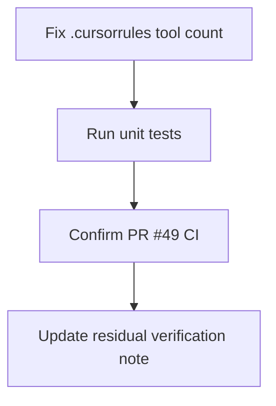

# LFG — PR #49 final verification and .cursorrules drift

## Summary

PR #49 is merge-ready; all P1–P3 + P2-4 work is Done. Fix stale **49-tool** reference in `.cursorrules` (registry has **60 canonical**, **56 advertised**), re-verify CI, and record a final verification note in the residual tracker.

---

## Flow



---

## Requirements

- R1. Update `.cursorrules` canonical tool count: 49 → 60 canonical (56 advertised by default).
- R2. Residual doc: add final LFG verification note with date and CI status.
- R3. Unit tests pass locally (`pytest -m unit`).
- R4. PR #49 required CI checks green (`pytest -m unit`, ubuntu headless).

---

## Scope Boundaries

- **In scope:** `.cursorrules` drift, residual verification note, CI confirmation.
- **Out of scope:** Merge to `master` (human); new features; TOOLS_LIST.md full recount.

---

## Implementation Units

- U1. Fix `.cursorrules` tool count line.
- U2. Residual doc final verification stamp.
- U3. Run tests + `gh pr checks 49`.

## Verification

```bash
uv run pytest -m unit -q --timeout=120
gh pr checks 49
```
