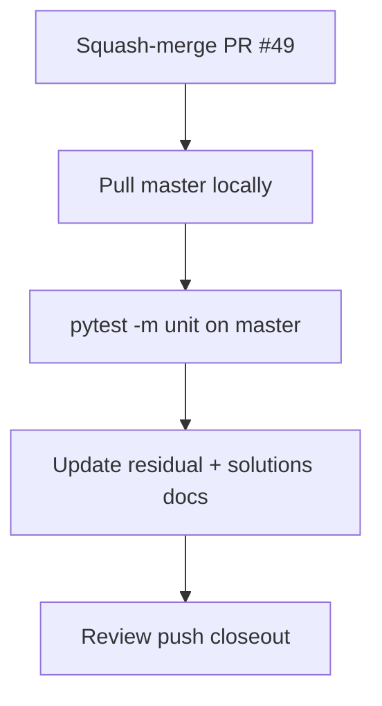

# LFG — PR #49 merge and post-merge closeout

## Summary

All agent-implementable gates are satisfied. Squash-merge PR #49 to `master`, verify unit tests on master, and record merge SHA in residual + solutions docs (PR #44 closeout pattern).

---

## Flow



---

## Requirements

- R1. Squash-merge PR #49 to `master` (CI green, mergeable).
- R2. `pytest -m unit` passes on `master` after merge.
- R3. Residual doc: mark merge gate done; record merge commit SHA.
- R4. Solutions doc: add merge SHA reference.
- R5. Push closeout commit to `master` or closeout branch.

---

## Scope Boundaries

- **In scope:** Merge, doc closeout, master verification.
- **Out of scope:** New features; live `lfg_validation.py` driver.

---

## Implementation Units

- U1. `gh pr merge 49 --squash`
- U2. Pull master; run unit tests.
- U3. Update `docs/residual-review-findings/impl-agent-native-audit-c2bc.md` and `docs/solutions/architecture-patterns/agent-native-mcp-patterns.md`.

## Verification

```bash
uv run pytest -m unit -q --timeout=120
```
