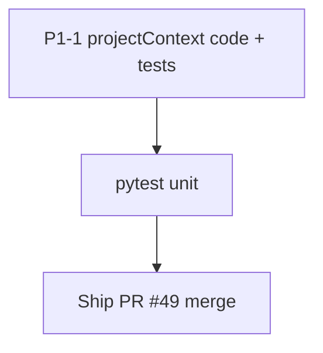

# LFG — ship audit PR + context injection (P1-1)

## Objective

Merge **PR #49** (agent-native audit docs) after CI green, and implement audit **P1-1**: extend passive `projectContext` with `analysisComplete`, `checkoutSummary`, and inject on error responses.

## Flow



## Requirements

| ID | Requirement | Verification |
|----|-------------|--------------|
| R1 | `collect_project_context` adds `analysisComplete` for active program | Unit test |
| R2 | Shared mode adds compact `checkoutSummary` when available | Unit test with mocked versioning |
| R3 | Error JSON responses include `projectContext` when session has programs | Unit test on `create_error_response` |
| R4 | PR #49 CI green and merged (or ready) | `gh pr checks 49` |

## Scope boundaries

- **In scope:** `program_metadata.py`, `tool_providers.create_error_response`, tests, residual doc update, `.cursor/commands/help.md`.
- **Out of scope:** `prompts/get`, proxy header, enum CRUD.

## Implementation units

### IU1 — Enrich `collect_project_context` + error injection

Files: `src/agentdecompile_cli/mcp_server/program_metadata.py`, `tool_providers.py`

### IU2 — Tests

File: `tests/test_project_context.py`

### IU3 — Discovery + residual doc

Files: `.cursor/commands/help.md`, `docs/residual-review-findings/impl-agent-native-audit-c2bc.md`

## Verification

```bash
uv run pytest tests/test_project_context.py -m unit -q --timeout=60
uv run pytest -m unit -q --timeout=120
```
