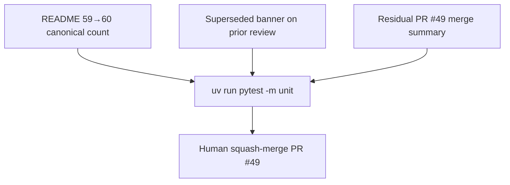

# LFG — PR #49 pre-merge doc polish

## Summary

PR #49 is merge-ready; all P1–P3 + P2-4 items are Done. Fix remaining **canonical tool count drift (59→60)** in README, archive superseded architecture review doc, and add a **PR summary fallback** in the residual tracker (gh pr edit blocked).

## Flow



---

## Requirements

- R1. README: update canonical tool count 59 → 60 (mermaid + prose); keep 56 advertised.
- R2. Add superseded banner to `docs/agent-native-architecture-review-2026-05-24.md` pointing to the May 24 audit.
- R3. Residual doc: add PR #49 summary section for merge reviewers.
- R4. Unit tests pass locally; PR #49 CI green on required checks.

---

## Scope Boundaries

- **In scope:** Doc drift fixes, merge reviewer summary.
- **Out of scope:** Merge to `master` (human); new features; MCP resource work.

---

## Implementation Units

- U1. Fix README tool counts (`README.md` lines ~16, ~753).
- U2. Superseded banner on prior review doc.
- U3. Residual doc PR summary for reviewers.

## Verification

```bash
uv run pytest -m unit -q --timeout=120
gh pr checks 49
```
