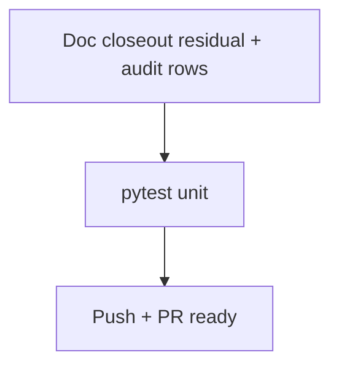

# LFG — ship PR #49

## Objective

Close out **PR #49**: agent-native audit docs + P1-1 `projectContext` enrichment + simplification pass. Refresh stale residual/audit rows, verify CI, mark PR ready for merge.

## Flow



## Requirements

| ID | Requirement | Verification |
|----|-------------|--------------|
| R1 | Residual doc reflects completed P1-1 polish (negative test, help.md) | File review |
| R2 | Audit Context Injection rows updated for analysis/checkout | `docs/audits/...` |
| R3 | `inject_project_context` preserves original JSON when no injection | Unit test unchanged |
| R4 | CI green on PR #49 | `gh pr checks 49` |

## Scope boundaries

- **In scope:** residual doc, audit scorecard rows, minor inject guard, PR ship.
- **Out of scope:** P1-2 prompts/get implementation, merge to master (human gate).

## Implementation units

### IU1 — Doc closeout

Files: `docs/residual-review-findings/impl-agent-native-audit-c2bc.md`, `docs/audits/2026-05-24-agent-native-audit.md`

### IU2 — inject_project_context no-op guard

File: `src/agentdecompile_cli/mcp_server/program_metadata.py`

## Verification

```bash
uv run pytest tests/test_project_context.py -m unit -q --timeout=60
uv run pytest -m unit -q --timeout=120
```
