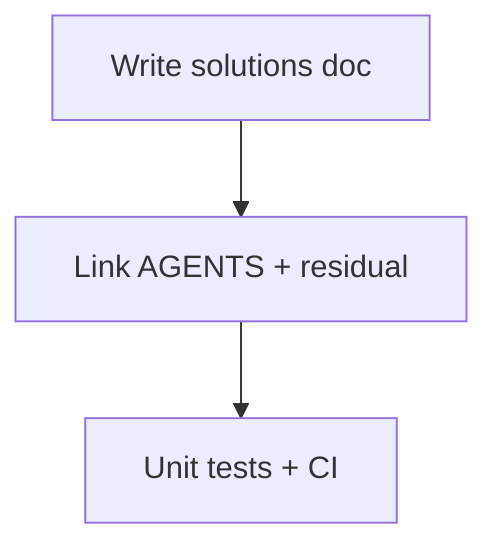

# LFG — PR #49 solutions compound (institutional learnings)

## Summary

PR #49 is merge-ready with no remaining code work. Capture agent-native audit learnings in `docs/solutions/` (ce-compound pattern) and link from AGENTS.md + residual tracker before human merge.

---

## Flow



---

## Requirements

- R1. Add `docs/solutions/architecture-patterns/agent-native-mcp-patterns.md` with frontmatter and key patterns from P1–P3.
- R2. Update `AGENTS.md` cross-link to solutions doc.
- R3. Residual doc: link solutions doc; record branch HEAD for merge traceability.
- R4. Unit tests pass; PR #49 CI green on required checks.

---

## Scope Boundaries

- **In scope:** Solutions doc, doc cross-links.
- **Out of scope:** Merge to `master` (human); new MCP features.

---

## Implementation Units

- U1. Solutions learning doc (projectContext, UI hints scoping, dynamic tool count test, prompts/get).
- U2. AGENTS.md + residual doc links and HEAD sha.

## Verification

```bash
uv run pytest -m unit -q --timeout=120
gh pr checks 49
```
