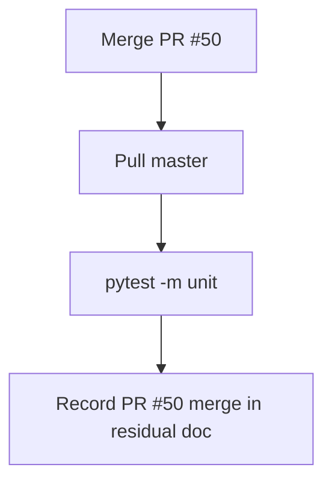

# LFG — PR #50 closeout merge to master

## Summary

PR #49 is merged (`13200d6`). PR #50 holds docs-only post-merge closeout. Merge PR #50 to `master`, verify unit tests, and mark the agent-native audit arc complete.

---

## Flow



---

## Requirements

- R1. Merge PR #50 to `master` (docs-only, CI green).
- R2. `pytest -m unit` passes on `master` after merge.
- R3. Residual doc notes PR #50 closeout merged (optional ship gate row).
- R4. Plan marked completed.

---

## Scope Boundaries

- **In scope:** Merge PR #50, verification, doc stamp.
- **Out of scope:** New features; live LFG driver.

---

## Implementation Units

- U1. `gh pr merge 50 --squash`
- U2. Pull master; run unit tests.
- U3. Residual doc PR #50 closeout note.

## Verification

```bash
uv run pytest -m unit -q --timeout=120
```
