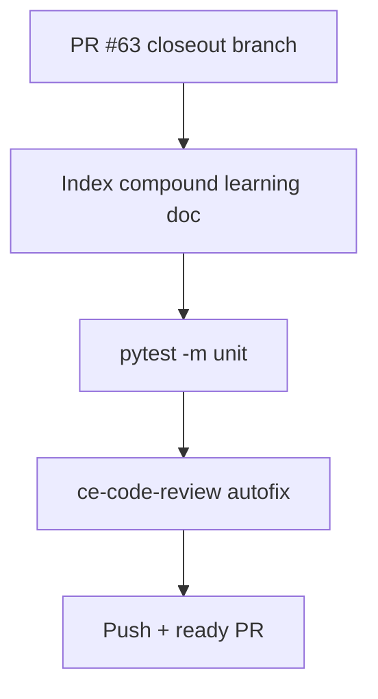

# LFG — ship PR #63 tiered RE closeout

## Objective

PR [#63](https://github.com/bolabaden/AgentDecompile/pull/63) is doc-only post-merge closeout for tiered RE arc (PR #62). Finish LFG pipeline: verify, index discovery, review, push, mark ready.



## Requirements

| ID | Requirement |
|----|-------------|
| R1 | `docs/solutions/architecture-patterns/tiered-re-analysis-routing.md` indexed in `docs/INDEX.md` |
| R2 | `docs/residual-review-findings/impl-tiered-re-knowledgebase-c2bc.md` present — residual actionable work: none |
| R3 | Closeout plan `2026-05-29-lfg-pr62-merge-closeout-c2bc.md` status completed |
| R4 | `uv run pytest -m unit -q` green |
| R5 | Frontmatter validation on new solution doc |
| R6 | PR #63 pushed; ready for review (undraft if CI green) |

## Out of scope

- Merge PR #63 (human gate unless admin merge requested)
- `agentdecompile://capabilities` MCP resource
- Dependabot #61

## Verification

```bash
python3 scripts/validate-frontmatter.py docs/solutions/architecture-patterns/tiered-re-analysis-routing.md
uv run pytest -m unit -q --timeout=120
```
