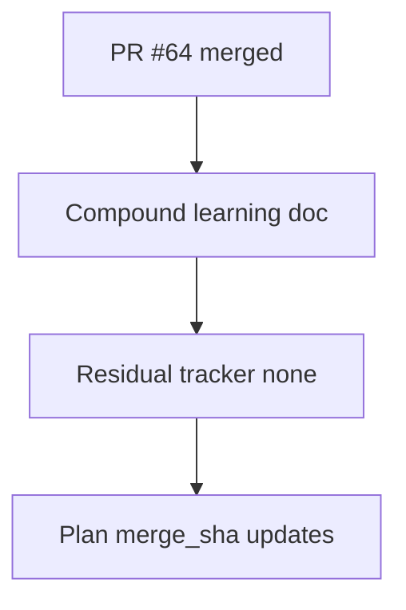

# LFG — PR #64 merge closeout

## Objective

Post-merge documentation for `agentdecompile://capabilities` (PR #64 squash `cd4b069`).



## Requirements

| ID | Requirement |
|----|-------------|
| R1 | Compound doc `docs/solutions/architecture-patterns/capabilities-mcp-resource.md` |
| R2 | Residual tracker — actionable work: none |
| R3 | Plans updated with `merge_sha: cd4b069` |
| R4 | `docs/INDEX.md` links compound doc |

## Verification

```bash
uv run pytest -m unit -q --timeout=120
python3 scripts/validate-frontmatter.py docs/solutions/architecture-patterns/capabilities-mcp-resource.md
```
