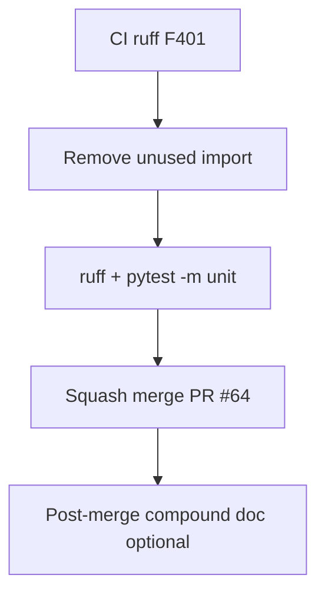

# LFG — ship PR #64 capabilities resource (fix CI)

## Objective

PR [#64](https://github.com/bolabaden/AgentDecompile/pull/64) adds `agentdecompile://capabilities`. CI failed on ruff F401 (unused `TOOLS` import in `server.py` after tool_reference extraction). Fix lint, verify green, merge.



## Requirements

| ID | Requirement |
|----|-------------|
| R1 | Remove unused `TOOLS` import from `mcp_server/server.py` |
| R2 | `uv run ruff check --no-fix src/ tests/` clean for changed files |
| R3 | `uv run pytest -m unit -q` — 143 passed |
| R4 | PR #64 CI green; squash merge to `master` |
| R5 | Plan `2026-05-24-lfg-capabilities-resource-c2bc.md` merge_sha updated |

## Out of scope

- Runtime `tools/list` filter by max tier
- Dependabot bumps

## Verification

```bash
uv run ruff check --no-fix src/agentdecompile_cli/mcp_server/server.py
uv run pytest -m unit -q --timeout=120
```
