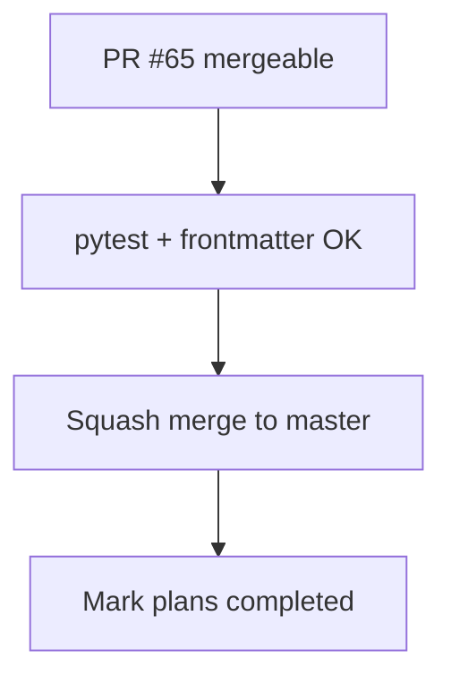

# LFG — ship PR #65 capabilities closeout

## Objective

PR [#65](https://github.com/bolabaden/AgentDecompile/pull/65) is doc-only post-merge closeout for PR #64. Verify CI, squash merge to `master`.



## Requirements

| ID | Requirement |
|----|-------------|
| R1 | Compound doc indexed in `docs/INDEX.md` |
| R2 | Residual tracker — actionable work: none |
| R3 | `uv run pytest -m unit -q` green |
| R4 | PR #65 CI green; squash merge |
| R5 | Closeout plan `2026-05-24-lfg-pr64-merge-closeout-c2bc.md` status completed |

## Out of scope

- Runtime `tools/list` filter by max tier (next cycle)
- Dependabot #61

## Verification

```bash
python3 scripts/validate-frontmatter.py docs/solutions/architecture-patterns/capabilities-mcp-resource.md
uv run pytest -m unit -q --timeout=120
```
