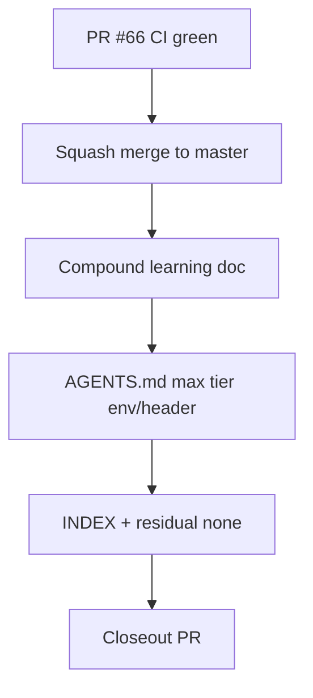

# LFG — ship PR #66 max analysis tier filter + closeout

## Objective

Squash-merge PR [#66](https://github.com/bolabaden/AgentDecompile/pull/66) (runtime `tools/list` filter by max `analysis_tier`), then post-merge closeout: compound learning doc, `AGENTS.md` env/header docs, plan `merge_sha` updates.



## Requirements

| ID | Requirement |
|----|-------------|
| R1 | PR #66 CI green; squash merge to `master` |
| R2 | Compound doc `docs/solutions/architecture-patterns/max-analysis-tier-filter.md` |
| R3 | `AGENTS.md` documents `AGENTDECOMPILE_MAX_ANALYSIS_TIER` and `X-AgentDecompile-Max-Analysis-Tier` |
| R4 | `docs/INDEX.md` links compound doc |
| R5 | Tier filter plan updated with `merge_sha`; residual actionable work: none |
| R6 | `uv run pytest -m unit -q --timeout=120` green |

## Out of scope

- Dependabot #61
- Tier 0 MCP wrappers (capa/yara/binwalk)
- HTTP integration test for tier header middleware

## Verification

```bash
uv run pytest -m unit -q --timeout=120
python3 scripts/validate-frontmatter.py docs/solutions/architecture-patterns/max-analysis-tier-filter.md
gh pr checks 66
```
