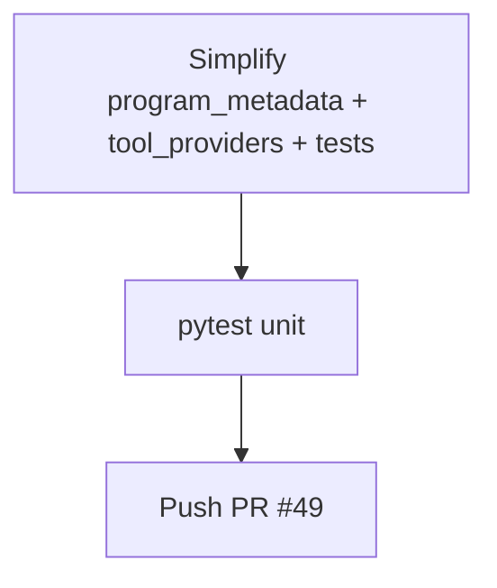

# LFG — simplify P1-1 projectContext

## Objective

Apply `ce-simplify-code` to the P1-1 diff on `impl/agent-native-audit-c2bc`: reduce duplication, unify injection paths, tighten tests — without behavior change.

## Flow



## Requirements

| ID | Requirement | Verification |
|----|-------------|--------------|
| R1 | Single analysis loop; `inject_project_context` delegates to `attach_project_context_to_payload` | Code review |
| R2 | Error path respects `_SKIP_CONTEXT_TOOLS` | Unit test or call_tool parity |
| R3 | Test fixture for session monkeypatch; negative empty-session error test | `test_project_context.py` |
| R4 | All unit tests pass | `pytest -m unit` |

## Scope boundaries

- **In scope:** `program_metadata.py`, `tool_providers.py`, `tests/test_project_context.py`, `.cursor/commands/help.md` (`analysisByProgram` doc line).
- **Out of scope:** Refactoring `import_export.py`, `search_everything.py`, session caching, audit scorecard update.

## Implementation units

### IU1 — Unify injection + analysis loop

Files: `program_metadata.py`, `tool_providers.py`

### IU2 — Test DRY + negative case

File: `tests/test_project_context.py`

## Verification

```bash
uv run pytest tests/test_project_context.py -m unit -q --timeout=60
uv run pytest -m unit -q --timeout=120
```
