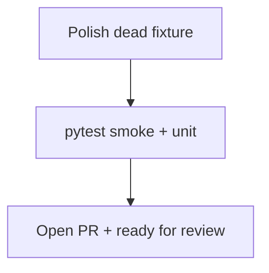

# LFG — ship `test_lfg_e2e` simplification

## Objective

Merge commit **`2a93e06`** on `impl/simplify-test-lfg-e2e-c2bc`: clearer env/exit helpers, leaner invalid-phase smoke, module-level `_lfg` loader. Open PR, verify CI, mark ready.

## Flow



## Requirements

| ID | Requirement | Verification |
|----|-------------|--------------|
| R1 | Remove unused `lfg` pytest fixture | `tests/test_lfg_e2e.py` has no orphan fixture |
| R2 | Smoke + unit tests pass | `pytest tests/test_lfg_e2e.py -m "not lfg"` and `-m unit` |
| R3 | PR opened from branch | `gh pr list` shows open PR |
| R4 | Branch pushed | `origin/impl/simplify-test-lfg-e2e-c2bc` up to date |

## Scope boundaries

- **In scope:** `tests/test_lfg_e2e.py` polish, PR ship.
- **Out of scope:** Full `LFG_RUN=1` driver; changes to `scripts/lfg_validation.py`.

## Implementation units

### IU1 — Drop unused `lfg` fixture

Tests call `_run()` directly; fixture is unused after simplify pass.

### IU2 — Ship PR

Push, `gh pr create`, `gh pr ready`, verify checks.

## Verification

```bash
uv run pytest tests/test_lfg_e2e.py -m "not lfg" -q --timeout=60
uv run pytest -m unit -q --timeout=120
uv run ruff check tests/test_lfg_e2e.py
```
