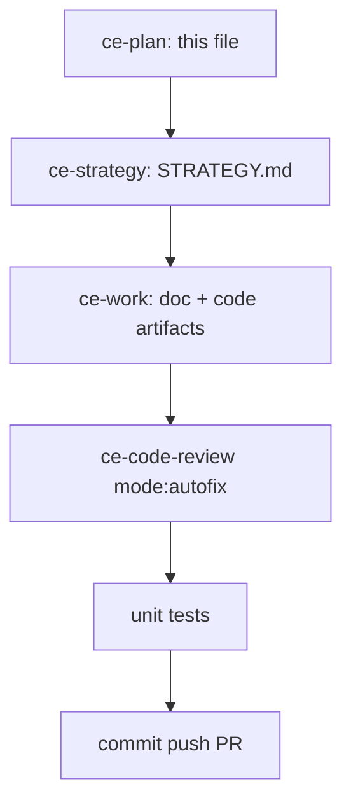

# LFG — strategy, doc review, and code review

## Objective

On branch `impl/blocking-analysis-gate-c2bc`, run the `/lfg` pipeline with `ce-strategy`, `ce-doc-review`, and `ce-code-review` before merge of PR [#39](https://github.com/bolabaden/AgentDecompile/pull/39).

## Flow



## Scope

| In scope | Out of scope |
|----------|----------------|
| First `STRATEGY.md` anchored to README/AGENTS | User interview for strategy |
| Doc review: blocking gate plan + compound bootstrap plan | Full plan corpus sweep |
| Code review vs `f40d81ea` (analysis gate, CLI, docs/solutions) | Canonical Ghidra `/lfg` driver (post-merge P3) |
| Residual doc sync | Browser UI tests |

## Requirements traceability

| ID | Requirement | Verification |
|----|-------------|--------------|
| R1 | `STRATEGY.md` at repo root with valid frontmatter | File exists; `last_updated` set |
| R2 | Primary plan doc-reviewed; stale verification text updated | `docs/plans/2026-05-24-blocking-program-analysis-gate.md` |
| R3 | Compound bootstrap plan status reflects completed bootstrap | `docs/plans/2026-05-24-compound-refresh-bootstrap.md` |
| R4 | No open P0/P1 code findings on analysis gate / dispatch | `ce-code-review` + 38 unit tests |
| R5 | Residual findings durable (PR body or fallback file) | `docs/residual-review-findings/impl-blocking-analysis-gate-c2bc.md` |

## Implementation units

1. **`STRATEGY.md`** — product anchor (MCP + PyGhidra RE for agent users)
2. **Doc review pass** — blocking gate plan + compound bootstrap plan; apply safe clarifications
3. **Code review** — `mode:autofix` against this plan; pytest gate/CLI tests
4. **Residual handoff** — update fallback doc; note P3 post-merge items only

## Verification

```bash
uv run pytest tests/test_program_analysis_gate.py tests/test_tool_providers_analysis_gate.py tests/test_cli_agent_help.py -m unit -q
python3 scripts/validate-frontmatter.py docs/solutions/integration-issues/mcp-program-analysis-gate.md
```
