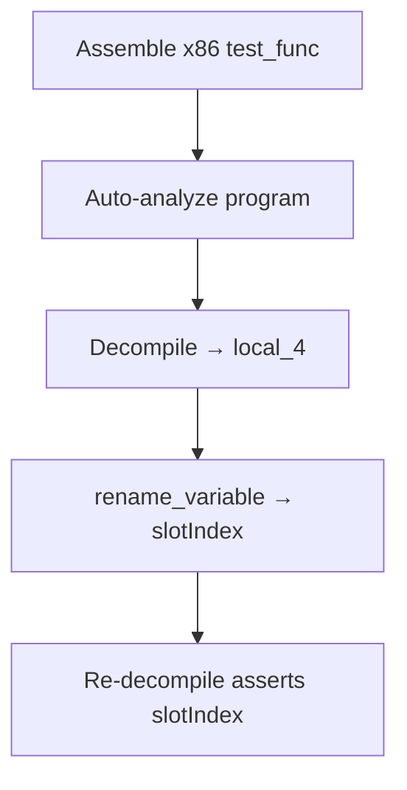

# LFG — Ghidra integration test for variable rename persistence

## Summary

Add a PyGhidra integration test proving `manage-function` `rename_variable` persists decompiler variable names in the program database, closing optional residual work from the agent-native audit arc.



---

## Problem Frame

PR #92 shipped variable rename handlers with unit tests (schema, aliases, mocked dispatch). Residual tracker lists optional Ghidra integration test to prove `HighFunctionDBUtil.updateDBVariable` persistence end-to-end.

---

## Requirements

| ID | Requirement |
|----|-------------|
| R1 | `create_test_program_with_stack_function()` helper builds analyzable x86 function with stack locals |
| R2 | Integration test calls `GetFunctionToolProvider` rename path on real program |
| R3 | Test asserts re-decompiled C contains renamed variable |
| R4 | Mark `@pytest.mark.integration`; skip when `GHIDRA_INSTALL_DIR` missing or invalid |
| R5 | Update residual tracker: variable rename integration test **Done** |
| R6 | `uv run pytest tests/test_variable_rename_integration.py -m integration -v` passes when Ghidra available; skips otherwise |

---

## Scope Boundaries

- No handler code changes unless test reveals a bug
- No MCP server e2e (provider-level integration only)
- No set_variable_type integration in this slice

---

## Implementation Units

- U1. **Test program helper** — `tests/helpers.py` assemble minimal stack-frame function
- U2. **Integration test** — `tests/test_variable_rename_integration.py`
- U3. **Residual tracker** — `docs/residual-review-findings/impl-agent-native-audit-c2bc.md`

---

## Key Technical Decisions

- Use Ghidra `Assemblers.getAssembler` on `ProgramBuilder` program (same pattern as `create_test_program`)
- Provider test: set `program_info` on `GetFunctionToolProvider`, call `_handle_manage` with `mode=rename_variable`
- Skip guard: `pytest.importorskip` + `GHIDRA_INSTALL_DIR` directory check in module or fixture

---

## Verification

```bash
uv run pytest tests/test_variable_rename_integration.py -v --timeout=180
uv run pytest -m unit -q --timeout=120
```
