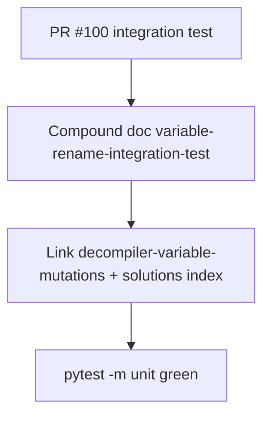

# LFG — Variable rename integration test closeout + compound doc

## Summary

PR #100 adds a PyGhidra integration test proving `rename_variable` persists in decompiled output. This closeout compounds the test pattern, cross-links solutions docs, and marks the feature plan completed.



---

## Requirements

| ID | Requirement |
|----|-------------|
| R1 | Add `docs/solutions/architecture-patterns/variable-rename-integration-test.md` |
| R2 | Link from `docs/solutions/README.md` and `decompiler-variable-mutations.md` |
| R3 | Mark feature plan `status: completed` |
| R4 | `uv run pytest tests/test_variable_rename_integration.py -m unit -q` passes |
| R5 | Full unit suite green |

---

## Implementation Units

- U1. Compound doc — R1
- U2. Cross-links — R2
- U3. Plan stamp — R3

---

## Verification

```bash
uv run pytest tests/test_variable_rename_integration.py -m unit -q --timeout=60
uv run pytest -m unit -q --timeout=120
```
