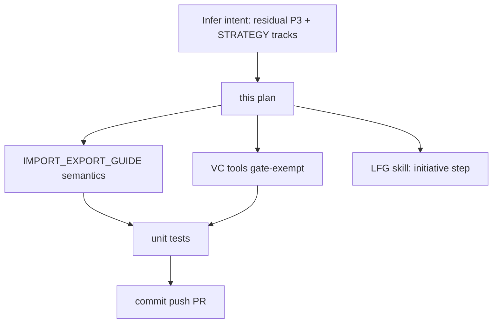

# Post-merge P3 hygiene after PR #42

## Objective

After [#42](https://github.com/bolabaden/AgentDecompile/pull/42) merged `STRATEGY.md` and LFG artifacts, clear the highest-value **P3** items from [docs/residual-review-findings/impl-blocking-analysis-gate-c2bc.md](../residual-review-findings/impl-blocking-analysis-gate-c2bc.md) without waiting for a full Ghidra `/lfg` driver.

## Flow



## Requirements traceability

| ID | Requirement | Verification |
|----|-------------|--------------|
| R1 | `IMPORT_EXPORT_GUIDE.md` matches in-session ensure semantics | Doc section + cross-ref AGENTS.md |
| R2 | `checkout-program`, `checkin-program`, `checkout-status` exempt from pre-dispatch analysis wait | `_ANALYSIS_GATE_EXEMPT_TOOLS` + parametrized unit test |
| R3 | Project `lfg` skill documents autonomous next-step inference | `.cursor/skills/lfg/SKILL.md` step 0 |
| R4 | Residual doc updated for closed P3 items | `impl-blocking-analysis-gate-c2bc.md` |
| R5 | No regressions in analysis gate tests | `pytest -m unit` gate modules |

## Implementation units

1. **Docs** — `IMPORT_EXPORT_GUIDE.md` analysis semantics; residual findings closure notes
2. **Code** — `program_analysis.py` VC exempt tools
3. **Agent workflow** — `.cursor/skills/lfg/SKILL.md` (initiative / infer-intent before ce-plan)

## Out of scope

- `scripts/lfg_validation.py` / full Ghidra proof driver (needs live Ghidra Server)
- Lock-map pruning for long-lived servers (separate small PR if needed)

## Verification

```bash
uv run pytest tests/test_program_analysis_gate.py tests/test_tool_providers_analysis_gate.py -m unit -q
```
