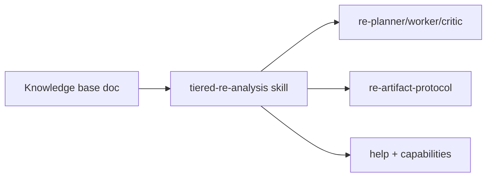

# Tiered RE analysis knowledge base and agent alignment

## Objective

Research and codify a **tiered reverse-engineering workflow** so AgentDecompile agents and skills use Ghidra MCP only when lighter techniques cannot satisfy quality/performance requirements.



## Deliverables

| Item | Path |
|------|------|
| Knowledge base | `docs/solutions/architecture-patterns/tiered-re-analysis-knowledgebase.md` |
| Cursor skill | `.cursor/skills/tiered-re-analysis/SKILL.md` |
| RE Planner tier-0 triage | `.github/agents/re-planner.agent.md` |
| Worker/Critic routing | `.github/agents/re-worker.agent.md`, `re-critic.agent.md` |
| Protocol tier matrix | `.github/instructions/re-artifact-protocol.instructions.md` |
| Discovery commands | `.cursor/commands/help.md`, `capabilities.md` |
| Index + AGENTS.md | `docs/INDEX.md`, `AGENTS.md` |

## Source synthesis

- In-repo multi-agent RE pipeline (Planner/Worker/Critic/Aggregator + artifact protocol)
- Kong-style phased pipeline (triage → bottom-up analysis → synthesis → export)
- FORGE FoA (bounded agent context, parallel decomposition)
- Agent-native audit `primitive_tier` recommendation
- Existing ghidrecomp CLI and analysis gate patterns

**Note:** External article URL was not attached in the originating request; KB documents synthesis sources and invites URL addition.

## Verification

```bash
python3 scripts/validate-frontmatter.py docs/solutions/architecture-patterns/tiered-re-analysis-knowledgebase.md
uv run pytest -m unit -q --timeout=120
```

## Follow-up (LFG 2026-05-29)

- **`analysis_tier` on `ToolMetadata`** — implemented in PR #62 follow-up commit; see `docs/plans/2026-05-29-lfg-pr62-analysis-tier-c2bc.md`

## Out of scope (future)

- MCP wrappers for capa/yara/binwalk
- `agentdecompile://capabilities` resource with tier metadata
