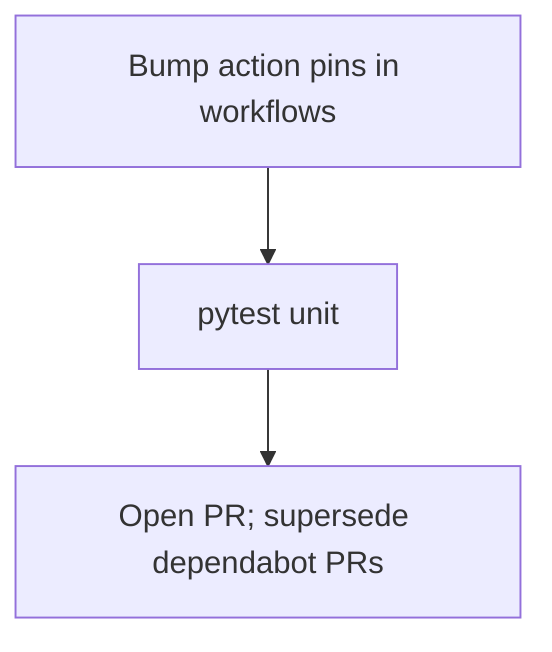

# LFG — batch CI GitHub Actions bumps

## Objective

Consolidate open Dependabot action bumps into one PR on `master`: `download-artifact` v8, `setup-buildx-action` v4, `login-action` v4, `sigstore/gh-action-sigstore-python` v3.3.0. Supersedes Dependabot PRs [#25](https://github.com/bolabaden/AgentDecompile/pull/25), [#31](https://github.com/bolabaden/AgentDecompile/pull/31), [#36](https://github.com/bolabaden/AgentDecompile/pull/36), [#37](https://github.com/bolabaden/AgentDecompile/pull/37).

## Flow



## Requirements

| ID | Requirement | Verification |
|----|-------------|--------------|
| R1 | `actions/download-artifact@v8` in `docker-push.yml`, `publish-ghidra.yml`, `publish-pypi.yml` | `rg download-artifact` |
| R2 | `docker/setup-buildx-action@v4` in `docker-push.yml` (both jobs) | grep |
| R3 | `docker/login-action@v4` in `docker-push.yml` (all uses) | grep |
| R4 | `sigstore/gh-action-sigstore-python@v3.3.0` in publish workflows | grep |
| R5 | Unit suite green | `uv run pytest -m unit -q --timeout=120` |
| R6 | Note superseded Dependabot PRs in PR body | manual |

## Scope

- **In scope:** Workflow pin bumps only.
- **Out of scope:** uv dependency group (#35); setup-ghidra (#38, done in #55); Docker PR #29.

## Verification

```bash
rg 'download-artifact@|setup-buildx-action@|login-action@|sigstore/gh-action' .github/workflows/
uv run pytest -m unit -q --timeout=120
```

Verified on branch `impl/ci-actions-bump-c2bc` (2026-05-28): all action pins match R1–R4; `124 passed, 61 deselected` for R5.

## PR body (R6)

Include in the PR description when opening:

> Supersedes Dependabot PRs #25, #31, #36, #37 (batch CI GitHub Actions bumps: `download-artifact@v8`, `setup-buildx-action@v4`, `login-action@v4`, `sigstore/gh-action-sigstore-python@v3.3.0`).
