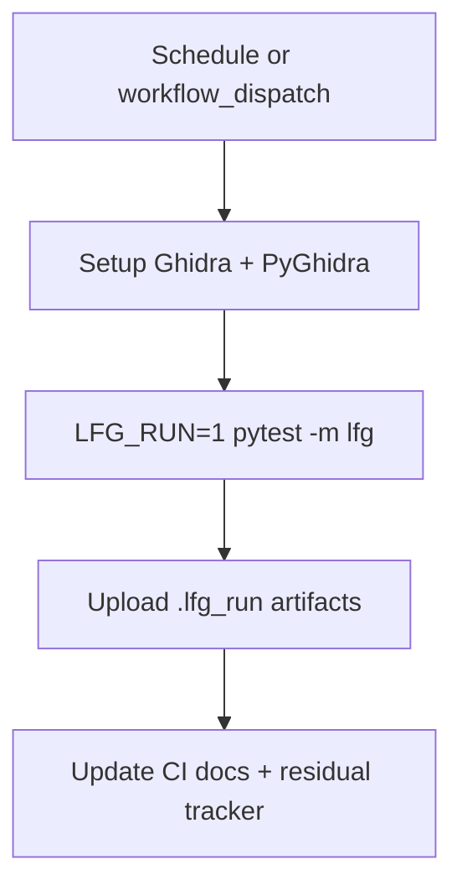

# LFG nightly CI workflow

## Objective

Close the remaining **P3** downstream item: run canonical `/lfg` in CI or nightly. Add a GitHub Actions workflow that runs `tests/test_lfg_e2e.py -m lfg` with `LFG_RUN=1` on a schedule and manual dispatch, using self-managed Ghidra Server + MCP on Linux CI (see `scripts/lfg_validation.py`).

**Pointers:** Residual [impl-blocking-analysis-gate-c2bc.md](../residual-review-findings/impl-blocking-analysis-gate-c2bc.md) §Closed (2026-05-28 LFG); existing smoke in unit CI via `@pytest.mark.unit` tests in `tests/test_lfg_e2e.py`.

## Flow



## Requirements

| ID | Requirement | Verification |
|----|-------------|--------------|
| R1 | New workflow `.github/workflows/lfg-nightly.yml` with `schedule` (weekly) + `workflow_dispatch` | File exists; valid YAML |
| R2 | Job installs Ghidra 12.0, Java 21, PyGhidra; sets `GHIDRA_INSTALL_DIR` | Mirrors `test-headless.yml` pattern |
| R3 | Runs `LFG_RUN=1 LFG_MANAGE_GHIDRA_SERVER=1 uv run pytest tests/test_lfg_e2e.py -m lfg -v --timeout=900` | Workflow step command |
| R4 | Uploads `.lfg_run/` artifacts on failure (and on success for debug) | `actions/upload-artifact` |
| R5 | Document workflow in `.github/CI_WORKFLOWS.md`; update residual doc — move P3 e2e to closed with workflow link | Doc diff |
| R6 | Unit suite unchanged green | `uv run pytest -m unit -q --timeout=120` |

## Scope boundaries

- **In scope:** Workflow, CI docs, residual tracker update.
- **Out of scope:** Windows `lfg_cmd_sequence.ps1` driver in CI; making LFG required on every PR (too slow/heavy); external shared Ghidra Server secrets (workflow uses `--manage-ghidra-server` locally).

## Implementation units

### IU1 — `.github/workflows/lfg-nightly.yml`

- `ubuntu-latest`, timeout 90 minutes.
- Triggers: `cron: '0 6 * * 0'` (Sunday 06:00 UTC), `workflow_dispatch`.
- Steps: checkout, Java 21, setup-ghidra@12.0, uv sync, PyGhidra install.
- Env: unset injected Ghidra server proxy creds (local self-managed stack).
- Test: `LFG_RUN=1`, `LFG_MANAGE_GHIDRA_SERVER=1`, `LFG_RUN_ID=ci_${{ github.run_id }}`.
- Artifact: `.lfg_run/` with 7-day retention.

### IU2 — Documentation

- `.github/CI_WORKFLOWS.md`: add workflow inventory + mermaid node.
- `docs/residual-review-findings/impl-blocking-analysis-gate-c2bc.md`: close P3 e2e item; reference workflow.

## Test scenarios

| Scenario | Expected |
|----------|----------|
| Workflow YAML syntax | `actionlint` or manual review passes |
| Local unit suite | 124 passed |
| `pytest tests/test_lfg_e2e.py -m "not lfg"` | smoke still passes (already in unit CI) |

## Verification

```bash
uv run pytest tests/test_lfg_e2e.py -m "not lfg" -q --timeout=60
uv run pytest -m unit -q --timeout=120
```

Full LFG stack verified post-merge by first green nightly run (not gating PR merge on this cycle).

## Risks

- First nightly run may fail on Linux Ghidra Server bootstrap — artifacts + logs enable iteration.
- Job duration ~15–45 min; keep off PR path.
