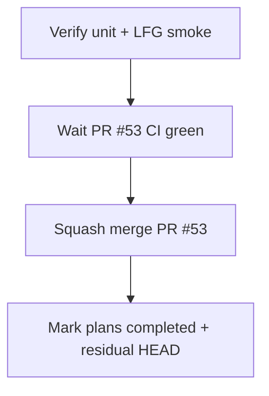

# LFG — ship PR #53 nightly CI workflow

## Summary

PR #53 adds weekly `lfg-nightly.yml` and closes the last blocking-analysis-gate P3 residual. Verify unit tests, confirm PR CI green, merge to `master`, update plan/residual with merge SHA.

## Flow



## Requirements

- R1. Branch `impl/lfg-nightly-ci-c2bc` rebased on current `master` (no conflicts).
- R2. `uv run pytest -m unit -q --timeout=120` passes locally.
- R3. `uv run pytest tests/test_lfg_e2e.py -m "not lfg" -q` passes.
- R4. PR #53 required checks green; squash merge.
- R5. Update `2026-05-28-lfg-nightly-ci-c2bc.md` and ship plan to `completed`; residual doc records PR #53 merge SHA.

## Scope

- **In scope:** Ship PR #53, doc closeout.
- **Out of scope:** First green nightly run (post-merge validation); dependabot PRs.

## Verification

```bash
uv run pytest tests/test_lfg_e2e.py -m "not lfg" -q --timeout=60
uv run pytest -m unit -q --timeout=120
gh pr checks 53
gh pr merge 53 --squash
```
