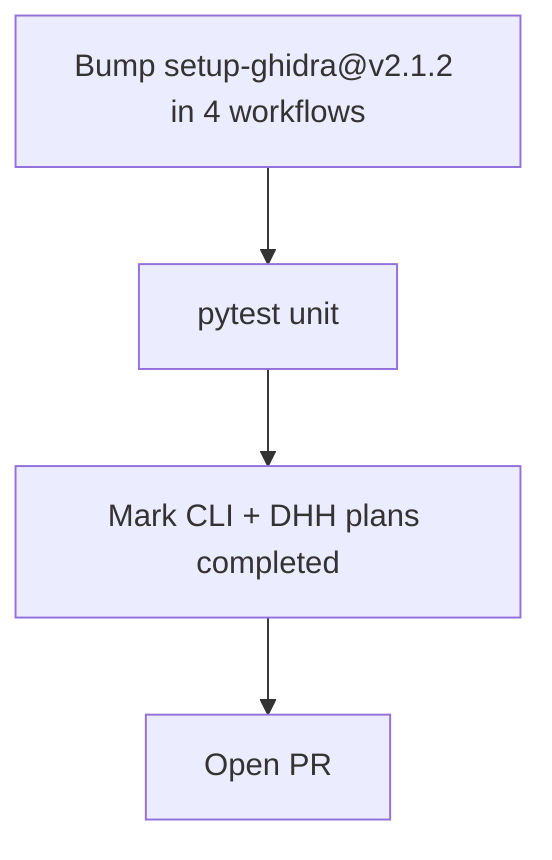

# LFG — setup-ghidra v2.1.2 + plan closeout

## Objective

Apply Dependabot [#38](https://github.com/bolabaden/AgentDecompile/pull/38) (`setup-ghidra` 2.0.16 → 2.1.2) across **all** Ghidra CI workflows including `lfg-nightly.yml`, then mark completed plans (`cli-agent-friendly-improvements`, `dhh-style-python-simplification`) as `completed` on `master`.

## Flow



## Requirements

| ID | Requirement | Verification |
|----|-------------|--------------|
| R1 | All workflows using `antoniovazquezblanco/setup-ghidra` pin `@v2.1.2` | `rg setup-ghidra` shows v2.1.2 only |
| R2 | Workflows: `test-ghidra.yml`, `test-headless.yml`, `publish-ghidra.yml`, `lfg-nightly.yml` | grep |
| R3 | Unit suite green | `uv run pytest -m unit -q --timeout=120` |
| R4 | CLI agent-friendly plan `status: completed` with note impl on master | plan frontmatter |
| R5 | DHH simplification plan `status: completed` (gate work merged via #39–#45) | plan frontmatter |

## Scope

- **In scope:** Workflow pin bump, plan status updates, solutions doc test count refresh.
- **Out of scope:** Other dependabot PRs (#31, #35–#37); Docker PR #29.

## Verification

```bash
rg 'setup-ghidra@v' .github/workflows/
uv run pytest tests/test_cli_agent_help.py tests/test_program_analysis_gate.py -m unit -q
uv run pytest -m unit -q --timeout=120
```
