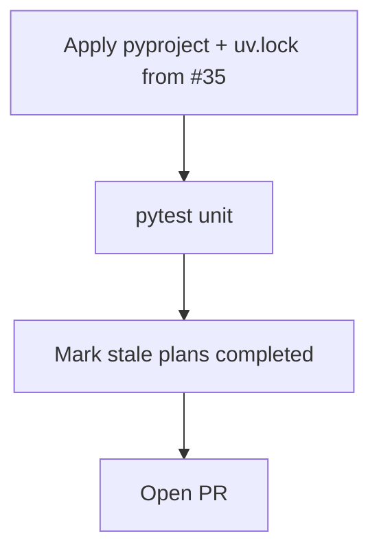

# LFG — uv bump and stale plan closeout

## Objective

Apply Dependabot [#35](https://github.com/bolabaden/AgentDecompile/pull/35) (`pip>=26.1`, lockfile refreshes including `cryptography` 46.0.7). Mark superseded `status: active` plans as `completed` on master: `blocking-analysis-code-review`, `lfg-p1-2-prompts-get-c2bc`, `lfg-pr46-ship-c2bc`, `lfg-pr49-p1-context-c2bc`, `lfg-simplify-p1-context-c2bc`, `lfg-strategy-doc-code-review`.

## Flow



## Requirements

| ID | Requirement | Verification |
|----|-------------|--------------|
| R1 | `pip>=26.1` in `pyproject.toml`; `uv.lock` updated | diff matches #35 intent |
| R2 | `uv sync` succeeds | exit 0 |
| R3 | Unit suite green | `uv run pytest -m unit -q --timeout=120` |
| R4 | Six stale active plans marked `completed` with note | `grep -c 'status: active' docs/plans/` → 1 (this plan) |
| R5 | Supersedes Dependabot #35 | PR body |

## Scope

- **In scope:** `pyproject.toml`, `uv.lock`, plan frontmatter updates.
- **Out of scope:** PR #29 Docker; superseded dependabot #25/#31 (already merged in #57).

## Verification

```bash
uv sync --all-extras --dev
uv run pytest -m unit -q --timeout=120
```
