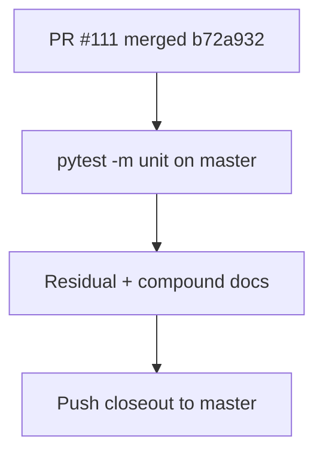

# LFG — CRUD mega-stack post-merge closeout

## Summary

After squash merge of PR **#111** (`b72a932` on `master`), verify unit tests on `master`, stamp residual/compound docs with merge SHA, and record superseded PR closeout blockers.



## Verification

```bash
uv run pytest -m unit -q --timeout=120  # 254 passed (2026-05-29)
gh pr view 111 --json state,mergeCommit
```

## Outcomes

| Action | Result |
|--------|--------|
| Squash merge #111 | **Done** via `gh pr merge 111 --squash` |
| `pytest -m unit` on master | **254 passed** |
| Residual **Merged** stamp | **Done** |
| Compound doc merge SHA | **Done** |
| Close #105–#110, #108 | **Blocked** — token lacks `closePullRequest` |
| PR #112 hygiene | **Conflicting** — superseded by closeout on master |
