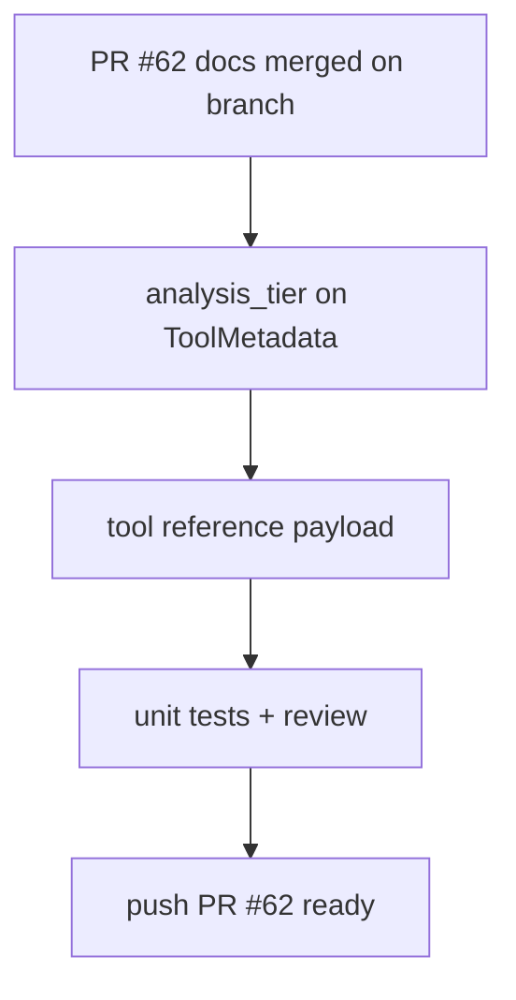

# LFG — PR #62 ship with analysis_tier registry metadata

## Step 0 — Objective

Close the tiered RE knowledge-base arc on branch `impl/tiered-re-knowledgebase-c2bc` (PR #62):

- PR #62 docs/skill/agents are landed; CI is green on required checks.
- Implement **`analysis_tier`** (2 = Ghidra MCP read-only/session, 3 = deep/mutate) on `ToolMetadata` in `registry.py` — the code follow-up named in the KB and agent-native audit.
- Expose tier in OpenAPI/tool-reference payload (`server.py`) for agent filtering.
- Add unit tests; mark PR ready for merge.



## Requirements

| ID | Requirement |
|----|-------------|
| R1 | `ToolMetadata.analysis_tier` is 2 or 3 for every canonical `Tool` (GUI-only excluded from advertised reference) |
| R2 | Tier 3 includes decompile, data-flow, workflows, and `_STATE_WRITING_TOOLS` |
| R3 | `_build_tool_reference_payload()` includes `analysis_tier` per tool |
| R4 | KB doc updated: `analysis_tier` implemented (not future) |
| R5 | `uv run pytest -m unit -q` green |

## Out of scope

- MCP wrappers for capa/yara/binwalk
- Filtering `tools/list` by tier at runtime
- Merging PR #62 (human gate unless admin merge requested)

## Verification

```bash
uv run pytest tests/test_tool_analysis_tier.py -m unit -q
uv run pytest -m unit -q --timeout=120
```
