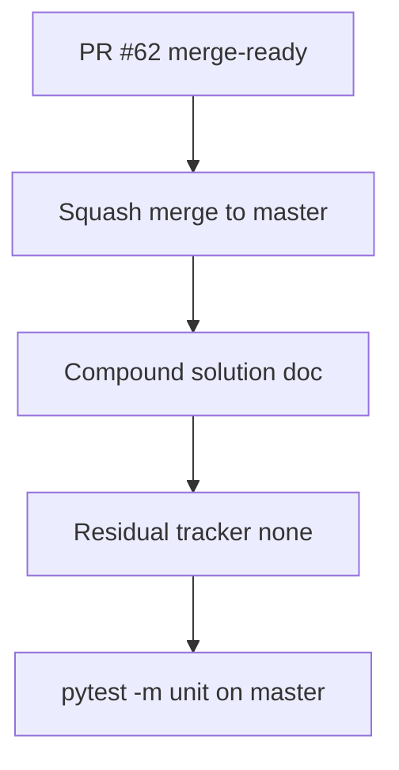

# LFG — merge PR #62 and post-merge tiered RE closeout

## Step 0 — Objective

PR [#62](https://github.com/bolabaden/AgentDecompile/pull/62) is **merge-ready** (unit, headless, CodeQL green; mergeable). Close the tiered RE arc:

1. Squash-merge PR #62 to `master`
2. On `master`, add compound learning doc + residual tracker (actionable work: none)
3. Mark tiered RE plans `completed`; verify unit tests on `master`



## Requirements

| ID | Requirement |
|----|-------------|
| R1 | PR #62 merged to `master` |
| R2 | `docs/solutions/architecture-patterns/tiered-re-analysis-routing.md` — compound learning (problem/solution, links KB) |
| R3 | `docs/residual-review-findings/impl-tiered-re-knowledgebase-c2bc.md` — residual actionable work: none |
| R4 | Plans `2026-05-24-tiered-re-knowledgebase-c2bc.md` and `2026-05-29-lfg-pr62-analysis-tier-c2bc.md` status completed |
| R5 | `uv run pytest -m unit -q` green on `master` |

## Out of scope

- `agentdecompile://capabilities` MCP resource (future)
- Dependabot #61 multipart bump (separate cycle)

## Verification

```bash
git checkout master && git pull origin master
uv run pytest -m unit -q --timeout=120
python3 scripts/validate-frontmatter.py docs/solutions/architecture-patterns/tiered-re-analysis-routing.md
```
