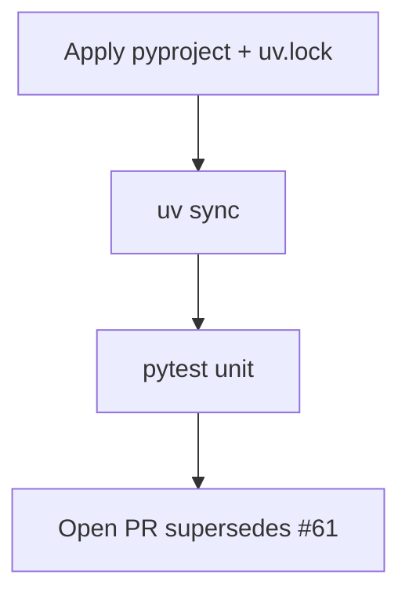

# LFG — python-multipart + pip uv group bump

## Objective

Apply Dependabot [#61](https://github.com/bolabaden/AgentDecompile/pull/61): `python-multipart` 0.0.26→0.0.27 and `pip` 26.1→26.1.1 in the uv lockfile.



## Requirements

| ID | Requirement | Verification |
|----|-------------|--------------|
| R1 | `pip>=26.1.1` in `pyproject.toml`; lock updated | diff matches #61 |
| R2 | `python-multipart` ≥0.0.27 in `uv.lock` (resolved 0.0.29) | grep lockfile |
| R3 | `uv sync` succeeds | exit 0 |
| R4 | Unit suite green | `uv run pytest -m unit -q --timeout=120` |
| R5 | Supersedes Dependabot #61 | PR body |

## Out of scope

- Tier 0 MCP wrappers (capa/yara/binwalk)
- Docker/setup-buildx dependabot #31

## Verification

```bash
uv sync --all-extras --dev
uv run pytest -m unit -q --timeout=120
```
