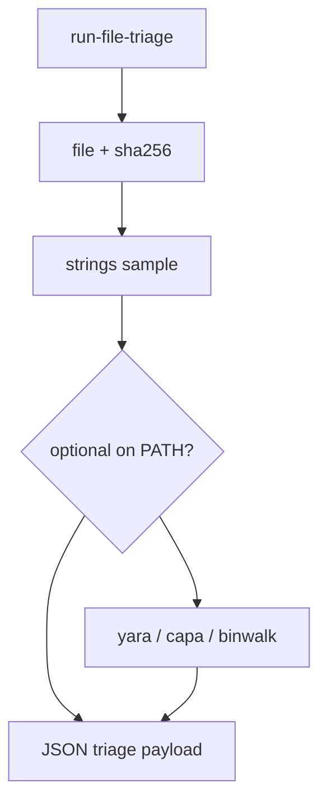

# LFG — Tier 0 run-file-triage MCP tool

## Objective

First Tier 0 MCP wrapper: `run-file-triage` runs `file`, `sha256sum`, and `strings` (plus optional `yara`/`capa`/`binwalk` when on PATH) without Ghidra. Unified JSON for RE artifact protocol.



## Requirements

| ID | Requirement |
|----|-------------|
| R1 | `Tool.RUN_FILE_TRIAGE` in registry; `analysis_tier` = 0 |
| R2 | `StaticAnalysisToolProvider` — no `_require_program()` |
| R3 | Params: `binaryPath`, optional `stringLimit`, `stringFilter`, `tryYara`, `tryCapa`, `tryBinwalk` |
| R4 | Response: `action`, `binaryPath`, `sha256`, `file`, `strings`, `optionalTools`, `suggestedTierEscalation` |
| R5 | Optional tools skip gracefully when binary missing from PATH |
| R6 | Unit tests with tmp binary; `uv run pytest -m unit` green |
| R7 | KB future-extensions note partial progress |

## Out of scope

- Separate MCP tools per capa/yara/binwalk
- Tier 1 ghidrecomp facade
- TOOLS_LIST.md full entry (follow-up)

## Verification

```bash
uv run pytest tests/test_run_file_triage.py tests/test_tool_analysis_tier.py -m unit -v
uv run pytest -m unit -q --timeout=120
uv run ruff check --no-fix src/agentdecompile_cli/mcp_utils/static_triage.py src/agentdecompile_cli/mcp_server/providers/static_analysis.py
```
