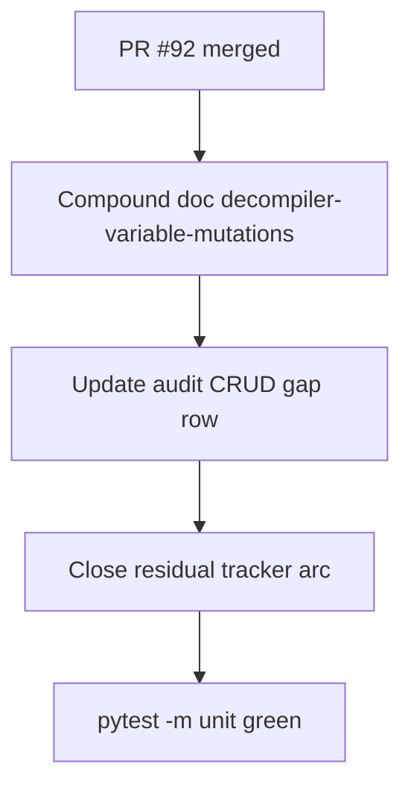

# LFG — Agent-native variable handlers closeout + audit sync

## Summary

PR #92 shipped `rename-variable` and `set-local-variable-type` handlers. This plan compounds the learning, syncs the stale audit CRUD gap, closes the residual tracker arc, and verifies `pytest -m unit` on master.



---

## Problem Frame

The rename-variable plan deferred compound documentation and audit/residual sync. `docs/audits/2026-05-24-agent-native-audit.md` still lists variable rename as a top CRUD gap; residual tracker HEAD and P2-5/P2-6 PR refs are stale.

---

## Requirements

| ID | Requirement | Status |
|----|-------------|--------|
| R1 | Add `docs/solutions/architecture-patterns/decompiler-variable-mutations.md` compound doc | Done |
| R2 | Update audit CRUD section: variable rename/type handlers **Done** (PR #92) | Done |
| R3 | Residual tracker: PR #92 refs, master HEAD, arc-complete note | Done |
| R4 | `uv run pytest -m unit -q --timeout=120` passes | Done |

---

## Scope Boundaries

- No new handler code or Ghidra integration tests (deferred e2e slice)
- No audit score recalculation beyond CRUD gap text

---

## Implementation Units

- U1. **Compound doc** — R1
- U2. **Audit sync** — R2, `docs/audits/2026-05-24-agent-native-audit.md`
- U3. **Residual closeout** — R3, `docs/residual-review-findings/impl-agent-native-audit-c2bc.md`
- U4. **Master verify** — R4

## Verification

```bash
uv run pytest -m unit -q --timeout=120
```
