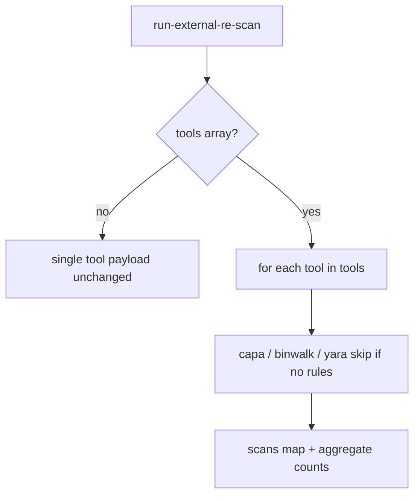

# LFG — Tier 0 run-external-re-scan multi-tool bundle

## Objective

Extend **`run-external-re-scan`** so agents can run **capa + binwalk + yara** in one MCP call via optional `tools` array, closing the KB “partial” external RE wrapper gap without adding a new tool.



## Requirements

| ID | Requirement |
|----|-------------|
| R1 | Optional `tools` param (array of yara/capa/binwalk); registry TOOL_PARAMS updated |
| R2 | When `tools` provided: return `mode: bundle`, `scans` dict keyed by tool, aggregate `counts` |
| R3 | Single-tool path unchanged when `tools` omitted (`tool` still required) |
| R4 | yara in bundle skips gracefully when `rulesPath` missing (no whole-bundle failure) |
| R5 | Aggregate `suggestedTierEscalation` picks highest useful tier from child scans |
| R6 | Provider schema documents `tools` array and `tool: all` alias |
| R7 | Unit tests for bundle + backward compat; `uv run pytest -m unit` green |
| R8 | KB marks external RE wrappers **Done** |

## Out of scope

- Bundled yara rule packs
- New MCP tool name
- TOOLS_LIST.md entry

## Verification

```bash
uv run pytest tests/test_run_external_re_scan.py -m unit -v
uv run pytest -m unit -q --timeout=120
uv run ruff check --no-fix src/agentdecompile_cli/mcp_utils/external_re_scan.py
```
