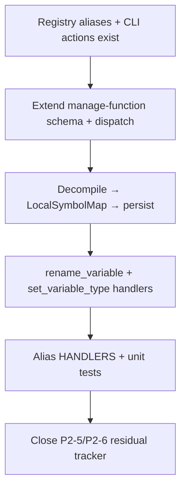
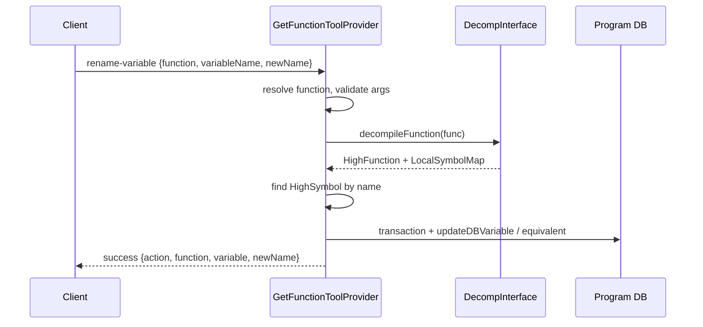

# LFG — rename-variable and set-local-variable-type handlers

## Summary

Implement decompiler-backed variable rename and local variable type handlers on `manage-function`, closing agent-native audit gaps P2-5 and P2-6. Wire registry aliases (`rename-variable`, `set-local-variable-type`, `change-variable-datatypes`), extend MCP schema and dispatch, add unit tests mirroring enum/symbol alias patterns, and mark residual tracker items Done.



---

## Problem Frame

Tiered RE workflows and TOOLS_LIST Deep Analysis loop document `rename-variable` and `set-local-variable-type`, but MCP calls fail because `GetFunctionToolProvider` only handles function-level modes. Registry params and CLI `--action` values exist; handlers and decompiler persistence do not. (see origin: `docs/residual-review-findings/impl-agent-native-audit-c2bc.md`)

---

## Requirements

- R1. `manage-function` accepts modes `rename_variable`, `set_variable_type`, and `change_datatypes` (plus CLI `action` aliases)
- R2. `rename-variable` alias resolves and forwards to `rename_variable` mode without requiring explicit `mode`
- R3. `set-local-variable-type` alias resolves and forwards to `set_variable_type` mode
- R4. Single rename: given function + `variableName`/`oldName` + `newName`, persist decompiler variable name
- R5. Single type set: given function + `variableName` + `newType`, persist decompiler variable type via `DataTypeParser`
- R6. Batch: `variableMappings` (`old:new,...`) and `datatypeMappings` (`var:type,...`) supported for `change_datatypes` or respective modes
- R7. Mutations run inside program transaction; versioned checkout notification after edit; conflict two-step flow when overwriting custom names/types
- R8. MCP `list_tools` schema documents variable modes and args
- R9. Unit tests: schema modes, alias `HANDLERS`, `resolve_tool_name`, mocked handler contracts
- R10. Mark P2-5 and P2-6 Done in `docs/residual-review-findings/impl-agent-native-audit-c2bc.md`
- R11. `uv run pytest -m unit -q --timeout=120` passes

**Origin actors:** MCP agent, CLI user  
**Origin flows:** F1 Deep Analysis improve loop (decompile → rename vars → fix types → verify)

---

## Scope Boundaries

- No new standalone MCP tools (extend `manage-function` only)
- No auto-match-propagate for variable renames in this slice
- No GUI/live CodeBrowser sync (headless persist + check-in only)
- No byte patching, program diff, or debugger tools

### Deferred to Follow-Up Work

- Integration test against real Ghidra binary (optional nightly/e2e follow-up)
- `docs/solutions/` compound doc for variable rename patterns (separate docs slice)

---

## Context & Research

### Relevant Code and Patterns

- `src/agentdecompile_cli/mcp_server/providers/getfunction.py` — `_handle_rename`, `_handle_set_return_type`, transaction + conflict flow
- `src/agentdecompile_cli/mcp_server/providers/enums.py` — alias `HANDLERS` + `_handle_mode_alias` pattern
- `src/agentdecompile_cli/registry.py` — aliases and `TOOL_PARAMS` for variable args
- `src/agentdecompile_cli/mcp_utils/decompiler_util.py` — `acquire_decompiler_for_program`
- `src/agentdecompile_cli/mcp_server/providers/_collectors.py` — read path via `HighFunction.getLocalSymbolMap()`
- `tests/test_manage_enums.py` — schema + alias registration tests

### Institutional Learnings

- Agent-native audit P2-5/P2-6 tracked in `docs/residual-review-findings/impl-agent-native-audit-c2bc.md`
- Naming conventions in `AGENTS.md`: locals/parameters `camelCase`
- Modification conflict flow: `resolve-modification-conflict` with `conflictId`

### External References

- `docs/PyGhidra_API_Reference.md` — `HighFunction`, `LocalSymbolMap`, `HighSymbol`
- Ghidra: `HighFunctionDBUtil.updateDBVariable` / decompiler persist APIs

---

## Key Technical Decisions

- **Provider location:** Extend `GetFunctionToolProvider` (same as function rename) rather than new provider — matches registry alias routing and audit recommendation
- **Decompiler path:** Decompile target function → locate symbol in `LocalSymbolMap` by decompiler name → persist via Ghidra decompiler DB util inside transaction — mirrors Ghidra GUI variable rename
- **Alias dispatch:** Add `HANDLERS` entries for normalized alias keys (`renamevariable`, `setlocalvariabletype`, `changevariabledatatypes`) presetting `mode`
- **Type parsing:** Reuse `DataTypeParser` pattern from `_handle_set_return_type`
- **Batch mappings:** Parse comma-separated `key:value` strings (CLI already documents format); apply sequentially with aggregated results

---

## Open Questions

### Resolved During Planning

- **Where to implement?** `getfunction.py` on existing `manage-function` provider
- **Advertise variable modes?** Yes — extend `manage-function` schema enum; aliases remain non-advertised per registry

### Deferred to Implementation

- Exact Ghidra API for persisting variable rename when symbol is stack vs register vs parameter — resolve against installed Ghidra 12.0.4 stubs at implementation time

---

## High-Level Technical Design

> *This illustrates the intended approach and is directional guidance for review, not implementation specification.*



---

## Implementation Units

- U1. **Schema and alias HANDLERS**

**Goal:** MCP schema and provider routing accept variable modes and aliases.

**Requirements:** R1, R2, R3, R8

**Dependencies:** None

**Files:**
- Modify: `src/agentdecompile_cli/mcp_server/providers/getfunction.py`

**Approach:**
- Extend `mode` enum: `rename_variable`, `set_variable_type`, `change_datatypes`
- Add schema properties: `variableName`, `oldName`, `newName`, `newType`, `variableMappings`, `datatypeMappings`
- Add `HANDLERS` alias entries and `_handle_mode_alias` helpers (follow `enums.py`)

**Patterns to follow:**
- `src/agentdecompile_cli/mcp_server/providers/enums.py`

**Test scenarios:**
- Happy path: schema enum includes all three variable modes
- Happy path: `HANDLERS` contains `renamevariable`, `setlocalvariabletype`, `changevariabledatatypes`
- Integration: `resolve_tool_name("rename-variable") == "manage-function"`

**Verification:**
- `list_tools()` advertises variable modes and args

---

- U2. **rename_variable handler**

**Goal:** Persist single or batch decompiler variable renames.

**Requirements:** R4, R6, R7

**Dependencies:** U1

**Files:**
- Modify: `src/agentdecompile_cli/mcp_server/providers/getfunction.py`
- Test: `tests/test_manage_function_variables.py`

**Approach:**
- `_handle_rename_variable`: resolve function, acquire decompiler, find symbol by `variableName` or `oldName`, apply `newName`
- Support `variableMappings` batch string
- Wrap in `_run_program_transaction`; conflict detection when overwriting non-default names
- `_notify_versioned_checkout_after_program_edit` after success

**Execution note:** Add unit tests with mocked decompiler/high-function before Ghidra integration paths.

**Patterns to follow:**
- `_handle_rename` conflict + transaction pattern in same file

**Test scenarios:**
- Happy path: mocked handler returns success with `action: rename_variable`
- Error path: missing `variableName` and `variableMappings` → clear error
- Error path: symbol not found in function → error with function context
- Edge case: `oldName` alias accepted same as `variableName`

**Verification:**
- Unit tests pass; handler registered in dispatch table

---

- U3. **set_variable_type and change_datatypes handlers**

**Goal:** Persist variable type changes (single + batch).

**Requirements:** R5, R6, R7

**Dependencies:** U1, U2 (shared decompiler helper)

**Files:**
- Modify: `src/agentdecompile_cli/mcp_server/providers/getfunction.py`
- Test: `tests/test_manage_function_variables.py`

**Approach:**
- `_handle_set_variable_type`: parse `newType` via `DataTypeParser`, apply to matched `HighSymbol`
- `_handle_change_datatypes`: parse `datatypeMappings`, delegate to type handler per entry
- Share decompiler acquire + symbol lookup helper from U2

**Patterns to follow:**
- `_handle_set_return_type` for type parsing

**Test scenarios:**
- Happy path: mocked set type returns success with parsed type name
- Error path: invalid `newType` string → parse error
- Happy path: batch `datatypeMappings` returns count and per-var results
- Error path: missing function identifier → error

**Verification:**
- Unit tests pass for both handlers

---

- U4. **Close residual tracker + verify**

**Goal:** Mark audit gaps done and confirm unit suite green.

**Requirements:** R10, R11

**Dependencies:** U2, U3

**Files:**
- Modify: `docs/residual-review-findings/impl-agent-native-audit-c2bc.md`

**Approach:**
- Mark P2-5, P2-6 Done with PR reference placeholder
- Run full unit suite

**Test scenarios:**
- Test expectation: none — documentation-only unit

**Verification:**
- P2-5/P2-6 rows show Done
- `uv run pytest -m unit -q --timeout=120` passes

---

## System-Wide Impact

- **Interaction graph:** `manage-function` dispatch only; aliases route through same provider
- **Error propagation:** Decompiler failures surface as tool errors with function/variable context
- **State lifecycle risks:** Transaction boundaries prevent partial variable renames in batch mode — rollback on failure within transaction
- **API surface parity:** CLI `--action rename_variable` / `set_variable_type` must work unchanged
- **Unchanged invariants:** Function-level modes (`rename`, `set_prototype`, etc.) unchanged

---

## Risks & Dependencies

| Risk | Mitigation |
|------|------------|
| Ghidra decompiler API variance across symbols | Try/fallback for stack vs parameter locals; clear errors |
| Batch partial failure | Single transaction or document per-item errors in response |
| Missing decompiler lock | Reuse `acquire_decompiler_for_program` lease pattern |

---

## Sources & References

- **Origin document:** `docs/residual-review-findings/impl-agent-native-audit-c2bc.md`
- Related code: `src/agentdecompile_cli/mcp_server/providers/getfunction.py`
- Related audit: `docs/audits/2026-05-24-agent-native-audit.md`
- Prior arc: PR #90 tiered RE closeout (deferred this slice)

## Verification

```bash
uv run pytest tests/test_manage_function_variables.py -m unit -q
uv run pytest -m unit -q --timeout=120
```
