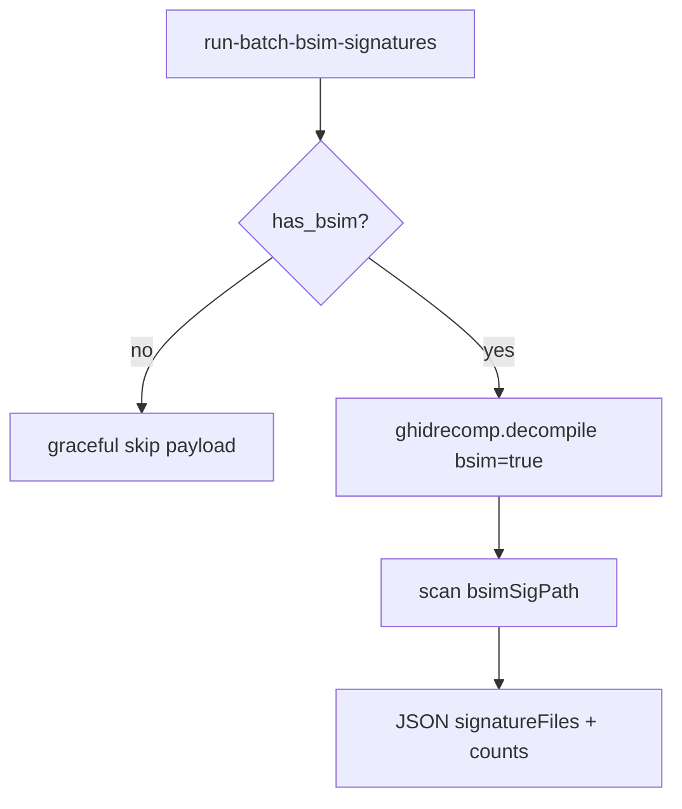

# LFG — Tier 1 run-batch-bsim-signatures MCP tool

## Objective

Tier 1 MCP wrapper for ghidrecomp **`--bsim`**: generate BSim function signature XML from a cold binary without an open MCP session program.



## Requirements

| ID | Requirement |
|----|-------------|
| R1 | `Tool.RUN_BATCH_BSIM_SIGNATURES` in registry; `analysis_tier` = 1 |
| R2 | Handler on `BatchAnalysisToolProvider` — no `_require_program()` |
| R3 | Params: `binaryPath`, optional `outputPath`, `bsimSigPath`, `bsimTemplate`, `bsimCategories`, `projectPath`, `forceAnalysis`, `functionFilter` |
| R4 | Response: `action`, `binaryPath`, `outputPath`, `bsimSigPath`, `signatureFiles`, `counts`, `bsim`, `suggestedTierEscalation` |
| R5 | Graceful skip when BSim unavailable (`bsim.available: false`) without raising |
| R6 | When available, run ghidrecomp with `bsim=True`; injectable `decompile_runner` and `bsim_checker` for tests |
| R7 | Unit tests mock runner/checker; `uv run pytest -m unit` green |
| R8 | KB + tool_reference note bsim wrapper progress |

## Out of scope

- sast wrapper (follow-up)
- Local BSim DB import
- TOOLS_LIST.md full entry

## Verification

```bash
uv run pytest tests/test_run_batch_bsim_signatures.py tests/test_tool_analysis_tier.py -m unit -v
uv run pytest -m unit -q --timeout=120
uv run ruff check --no-fix src/agentdecompile_cli/mcp_utils/batch_bsim.py
```
