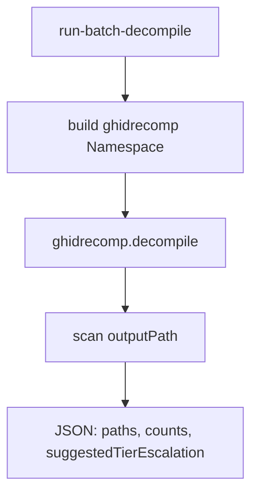

# LFG — Tier 1 run-batch-decompile MCP tool

## Objective

First Tier 1 MCP wrapper: `run-batch-decompile` invokes the existing `ghidrecomp.decompile` batch pipeline without an open MCP session program. Returns unified JSON artifact paths for offline ripgrep/semgrep workflows.



## Requirements

| ID | Requirement |
|----|-------------|
| R1 | `Tool.RUN_BATCH_DECOMPILE` in registry; `analysis_tier` = 1 |
| R2 | `BatchAnalysisToolProvider` — no `_require_program()` |
| R3 | Params: `binaryPath`, optional `outputPath`, `projectPath`, `functionFilter`, `skipCache`, `forceAnalysis`, `callgraphs`, `timeout` |
| R4 | Response: `action`, `binaryPath`, `outputPath`, `decompiledFiles`, `callgraphFiles`, `counts`, `suggestedTierEscalation` |
| R5 | Unit tests mock `ghidrecomp.decompile`; no JVM in unit suite |
| R6 | `uv run pytest -m unit` green |
| R7 | KB + tool_reference note Tier 1 partial progress |

## Out of scope

- Full ghidrecomp flag parity (bsim, sast, gzf) — follow-up tools
- TOOLS_LIST.md full entry
- Extending max-tier parse to accept literal `1` (tier 1 still visible when max tier is 2)

## Verification

```bash
uv run pytest tests/test_run_batch_decompile.py tests/test_tool_analysis_tier.py -m unit -v
uv run pytest -m unit -q --timeout=120
uv run ruff check --no-fix src/agentdecompile_cli/mcp_utils/batch_decompile.py src/agentdecompile_cli/mcp_server/providers/batch_analysis.py
```
