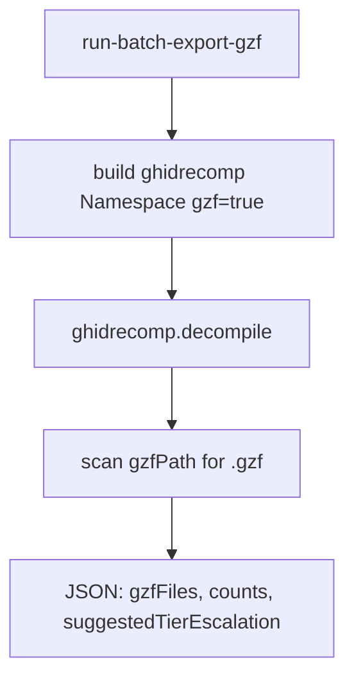

# LFG — Tier 1 run-batch-export-gzf MCP tool

## Objective

Second Tier 1 ghidrecomp MCP wrapper: **`run-batch-export-gzf`** runs headless analyze + packed `.gzf` export from a cold binary path (no open MCP session program). Distinct from Tier 3 session `export format=gzf`.



## Requirements

| ID | Requirement |
|----|-------------|
| R1 | `Tool.RUN_BATCH_EXPORT_GZF` in registry; `analysis_tier` = 1 |
| R2 | Handler on `BatchAnalysisToolProvider` — no `_require_program()` |
| R3 | Params: `binaryPath`, optional `outputPath`, `gzfPath`, `projectPath`, `forceAnalysis`, `skipSymbols` |
| R4 | Response: `action`, `binaryPath`, `outputPath`, `gzfPath`, `binOutputPath`, `gzfFiles`, `counts`, `suggestedTierEscalation` |
| R5 | `build_batch_gzf_payload()` calls ghidrecomp with `gzf=True`; injectable `decompile_runner` for tests |
| R6 | Unit tests mock runner; collect `{outputPath}/gzfs/{bin_proj_name}.gzf` when default gzfPath |
| R7 | `uv run pytest -m unit` green |
| R8 | KB future-extensions note gzf wrapper progress; tool_reference Tier 1 examples updated |

## Out of scope

- bsim/sast Tier 1 wrappers (follow-up)
- ghidrecomp analyze-only mode (full decompile still runs upstream)
- TOOLS_LIST.md full entry

## Verification

```bash
uv run pytest tests/test_run_batch_export_gzf.py tests/test_tool_analysis_tier.py -m unit -v
uv run pytest -m unit -q --timeout=120
uv run ruff check --no-fix src/agentdecompile_cli/mcp_utils/batch_gzf.py
```
