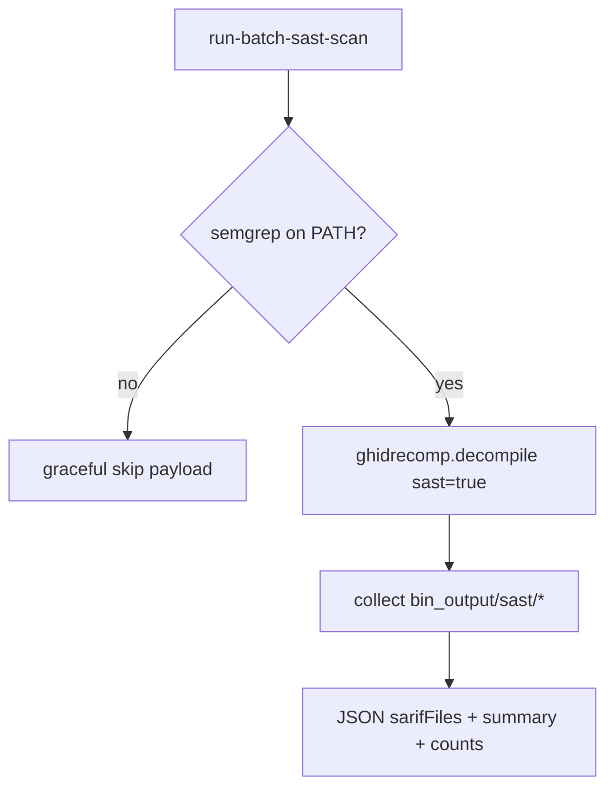

# LFG — Tier 1 run-batch-sast-scan MCP tool

## Objective

Tier 1 MCP wrapper for ghidrecomp **`--sast`**: Semgrep (and optional CodeQL placeholder) on decompiled C from a cold binary without an open MCP session program. Completes the ghidrecomp Tier 1 facade (decompile, gzf, bsim, sast).



## Requirements

| ID | Requirement |
|----|-------------|
| R1 | `Tool.RUN_BATCH_SAST_SCAN` in registry; `analysis_tier` = 1 |
| R2 | Handler on `BatchAnalysisToolProvider` — no `_require_program()` |
| R3 | Params: `binaryPath`, optional `outputPath`, `projectPath`, `functionFilter`, `forceAnalysis`, `semgrepRules` (array), `codeqlRules` (string) |
| R4 | Response: `action`, `binaryPath`, `outputPath`, `sastPath`, `sarifFiles`, `counts`, `sast`, optional `summary`, `suggestedTierEscalation` |
| R5 | Graceful skip when semgrep unavailable (`sast.available: false`) without JVM run |
| R6 | When available, run ghidrecomp with `sast=True`; injectable `decompile_runner` and `semgrep_checker` for tests |
| R7 | Unit tests mock runner/checker; `uv run pytest -m unit` green |
| R8 | KB + tool_reference mark Tier 1 ghidrecomp facade complete |

## Implementation units

| Unit | Files |
|------|-------|
| U1 Payload builder | `src/agentdecompile_cli/mcp_utils/batch_sast.py` |
| U2 Provider handler | `src/agentdecompile_cli/mcp_server/providers/batch_analysis.py` |
| U3 Registry | `src/agentdecompile_cli/registry.py` |
| U4 Docs | `docs/solutions/architecture-patterns/tiered-re-analysis-knowledgebase.md`, `src/agentdecompile_cli/mcp_utils/tool_reference.py` |
| U5 Tests | `tests/test_run_batch_sast_scan.py`, `tests/test_tool_analysis_tier.py` |

## Test scenarios

| Scenario | Expected |
|----------|----------|
| Tier assignment | `get_tool_analysis_tier(RUN_BATCH_SAST_SCAN) == 1` |
| Semgrep missing | Runner not called; `sast.available: false` |
| Semgrep present (mock) | `args.sast is True`; SARIF paths collected under `sast/` |
| Missing binary | `FileNotFoundError` |
| Provider handler | Success payload via mocked `build_batch_sast_payload` |
| Max tier 2 filter | Tool advertised in `get_advertised_tools_for_list()` |

## Out of scope

- TOOLS_LIST.md full entry
- Installing semgrep in CI
- CodeQL beyond ghidrecomp placeholder

## Verification

```bash
uv run pytest tests/test_run_batch_sast_scan.py tests/test_tool_analysis_tier.py -m unit -v
uv run pytest -m unit -q --timeout=120
uv run ruff check --no-fix src/agentdecompile_cli/mcp_utils/batch_sast.py
```
