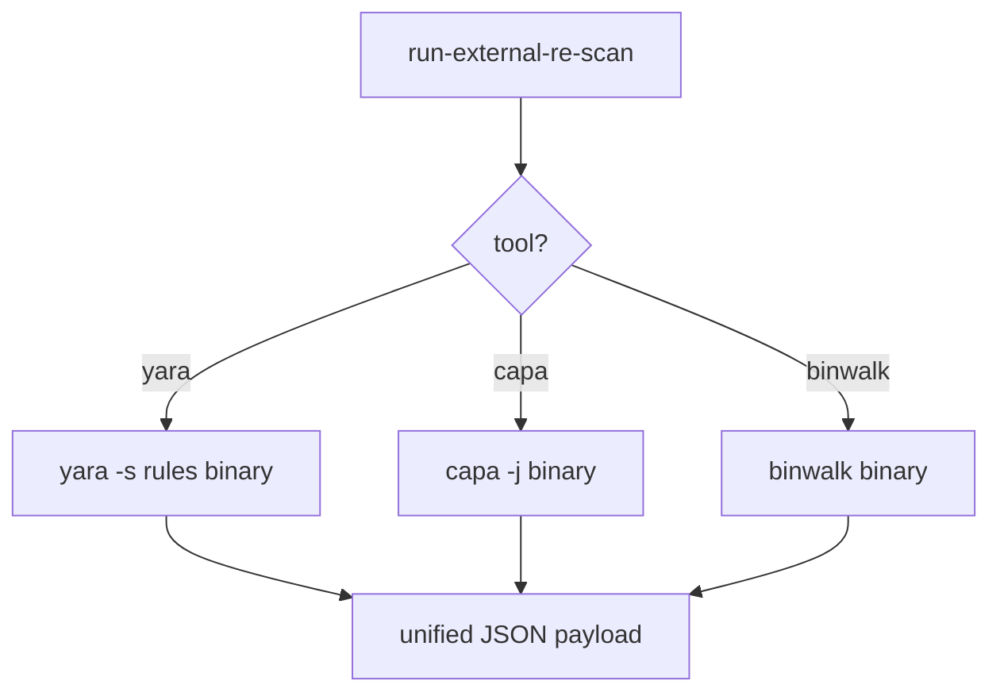

# LFG — Tier 0 run-external-re-scan MCP tool

## Objective

Unified Tier 0 MCP wrapper for **yara**, **capa**, and **binwalk** scans (not just PATH probes). Agents without shell access can run one external RE tool per call with a consistent JSON schema.



## Requirements

| ID | Requirement |
|----|-------------|
| R1 | `Tool.RUN_EXTERNAL_RE_SCAN` in registry; `analysis_tier` = 0 |
| R2 | Handler on `StaticAnalysisToolProvider` — no `_require_program()` |
| R3 | Params: `binaryPath`, `tool` (yara/capa/binwalk), optional `rulesPath`, `outputLimit`, `timeout` |
| R4 | Response: `action`, `binaryPath`, `tool`, `scan`, `lines`, `counts`, `suggestedTierEscalation` |
| R5 | Graceful skip when external binary missing from PATH |
| R6 | yara requires `rulesPath`; capa/binwalk run without extra paths |
| R7 | Unit tests with mocked subprocess; `uv run pytest -m unit` green |
| R8 | KB future-extensions note progress; registry metadata table lists tiers 0–1 |

## Out of scope

- Separate MCP tools per yara/capa/binwalk
- Bundled rule packs for yara
- TOOLS_LIST.md full entry

## Verification

```bash
uv run pytest tests/test_run_external_re_scan.py tests/test_tool_analysis_tier.py -m unit -v
uv run pytest -m unit -q --timeout=120
uv run ruff check --no-fix src/agentdecompile_cli/mcp_utils/external_re_scan.py
```
