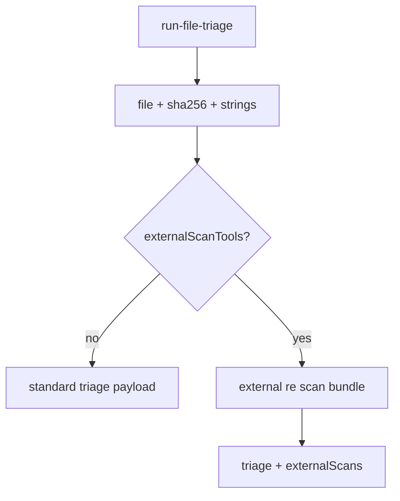

# LFG — run-file-triage optional embedded external scans

## Objective

One-call cold-binary triage: optional **`externalScanTools`** on `run-file-triage` embeds `run-external-re-scan` bundle results so RE Planner agents avoid a second MCP round-trip.



## Requirements

| ID | Requirement |
|----|-------------|
| R1 | Optional `externalScanTools` array on `run-file-triage`; registry TOOL_PARAMS updated |
| R2 | When set, embed bundle `scans` + `counts` under `externalScans` |
| R3 | Optional `rulesPath`, `scanOutputLimit`, `scanTimeout` for embedded scans |
| R4 | Default triage unchanged when `externalScanTools` omitted |
| R5 | Tier escalation prefers higher recommendation from bundle when present |
| R6 | Provider schema documents new params |
| R7 | Unit tests with mocked bundle; backward compat tests pass |
| R8 | tiered-re skill + agent-native audit note ghidrecomp/Tier 0-1 MCP paths |

## Out of scope

- New MCP tool
- TOOLS_LIST.md entry

## Verification

```bash
uv run pytest tests/test_run_file_triage.py -m unit -v
uv run pytest -m unit -q --timeout=120
uv run ruff check --no-fix src/agentdecompile_cli/mcp_utils/static_triage.py
```
