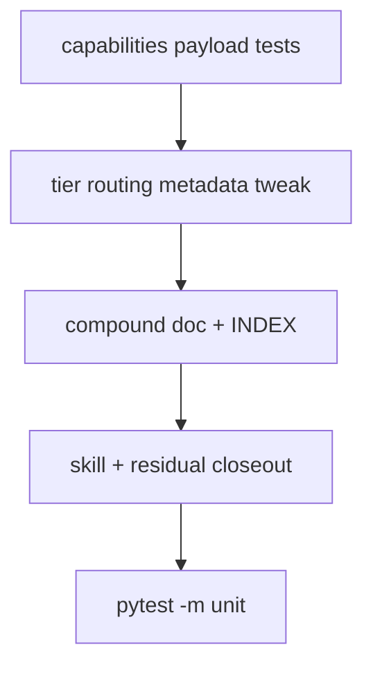

# LFG — Tier 0–1 capabilities verification + arc closeout

## Summary

PR #86 synced human-facing discovery docs to 66/62 tools and documented six Tier 0–1 MCP tools. This plan adds **machine-readable verification** via `agentdecompile://capabilities` tests, updates tier routing metadata in `tool_reference.py`, compounds the arc in `docs/solutions/`, and closes stale residual trackers.

---

## Problem Frame

The capabilities resource dynamically lists tools with `analysis_tier`, but tests only assert tiers 0–3 exist — not that all six `run-*` tools appear with correct tier and `advertised: true`. Residual trackers still list Tier 0–1 wrappers as future work.

---

## Requirements

- R1. Unit test: capabilities payload includes all six `run-*` tools with `analysis_tier` 0 or 1 and `advertised: true`.
- R2. Unit test: `summary.canonical_tool_count` / `advertised_tool_count` match registry dynamically.
- R3. Update `_TIER_ROUTING` tier 1 `ghidra` label to reflect MCP batch tools (not CLI-only).
- R4. Compound learning doc for Tier 0–1 MCP arc (PRs #80–#86).
- R5. Update `docs/INDEX.md` and mark capabilities residual future items Done.
- R6. Update tiered-re-analysis skill triage checklist to MCP-first (`run-file-triage` JSON → `triage.json`).

---

## Scope Boundaries

- No new MCP tools or registry entries.
- No browser/GUI testing.

---

## Key Technical Decisions

- Reuse `TIER01_RUN_TOOLS` constant pattern from `test_canonical_tool_parity.py` (shared tuple in test file, not cross-import).
- Compound doc covers full Tier 0–1 arc, not only PR #86.

---

## High-Level Technical Design

---

## Implementation Units

- U1. **Capabilities payload tier 0–1 tests**

**Goal:** Guard machine-readable discovery for six `run-*` tools.

**Requirements:** R1, R2

**Files:**
- Modify: `tests/test_capabilities_resource.py`

**Test scenarios:**
- Happy path: each `run-*` in payload tools with correct tier and advertised.
- Happy path: summary counts match `len(Tool)` and `len(get_advertised_tools_for_list())`.

**Verification:** `uv run pytest tests/test_capabilities_resource.py -m unit -q`

---

- U2. **Tier routing metadata**

**Goal:** Tier 1 routing JSON reflects MCP batch, not CLI-only.

**Requirements:** R3

**Files:**
- Modify: `src/agentdecompile_cli/mcp_utils/tool_reference.py`

**Test scenarios:**
- Integration: existing tier example test still passes; tier 1 examples include `run-batch-decompile`.

**Verification:** capabilities tests green.

---

- U3. **Compound doc + INDEX + residual closeout**

**Goal:** Institutional memory and tracker hygiene.

**Requirements:** R4, R5

**Files:**
- Create: `docs/solutions/architecture-patterns/tier01-mcp-discovery-sync.md`
- Modify: `docs/INDEX.md`, `docs/residual-review-findings/impl-capabilities-resource-c2bc.md`

**Verification:** INDEX links resolve; residual shows Done.

---

- U4. **Skill MCP-first triage**

**Goal:** Agents use `run-file-triage` before shell one-offs.

**Requirements:** R6

**Files:**
- Modify: `.cursor/skills/tiered-re-analysis/SKILL.md`

**Verification:** Skill mentions `run-file-triage` with `externalScanTools` and triage.json mapping.

---

## Sources & References

- PR #86: tier01 discovery sync
- PR #64: capabilities resource
- `tests/test_canonical_tool_parity.py` — `TIER01_RUN_TOOLS` pattern
