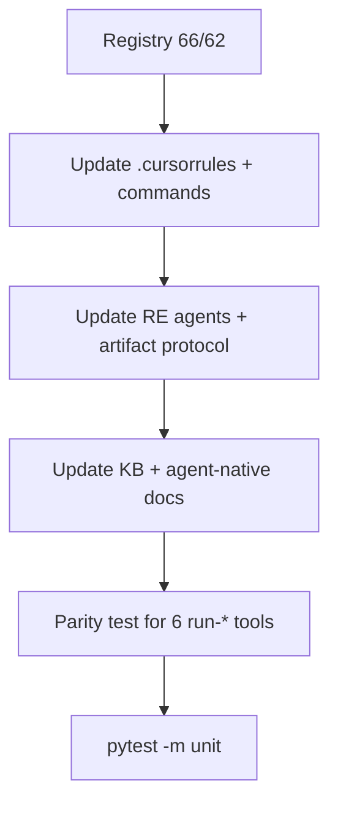

# LFG — Tier 0–1 MCP discovery sync (tool counts + agent docs)

## Summary

After landing six Tier 0–1 MCP tools (`run-file-triage`, `run-external-re-scan`, four `run-batch-*`), discovery docs still advertise **60 canonical / 56 advertised** and describe Tier 0–1 as shell/CLI-only. This plan updates counts to **66 / 62**, documents the MCP Tier 0–1 tools in capabilities, help, RE Planner, artifact protocol, knowledge base, and agent-native patterns — plus a small parity test asserting all six `run-*` tools are advertised.

---

## Problem Frame

Agents and slash commands (`/capabilities`, `/help`) are the primary discovery surface. Stale counts and missing Tier 0–1 MCP entries misroute cold-binary triage to shell one-offs or `agentdecompile-cli ghidrecomp` instead of `run-file-triage` / `run-external-re-scan` / `run-batch-*`. Dynamic parity tests already derive counts from the registry; human-facing docs drifted.

---

## Requirements

- R1. Update canonical/advertised tool counts to **66 / 62** (+ 4 GUI-only hidden) everywhere they appear in agent discovery docs.
- R2. Document six Tier 0–1 MCP tools in `.cursor/commands/capabilities.md` with tier routing table corrected (Tier 1 = MCP batch, not CLI-only).
- R3. Update `.github/agents/re-planner.agent.md` Phase 0 to prefer MCP `run-file-triage` / `run-external-re-scan` / `run-batch-*` over shell/ghidrecomp CLI where applicable.
- R4. Update `.github/instructions/re-artifact-protocol.instructions.md` tier table and MCP mapping with Tier 0–1 tools.
- R5. Add KB note for `externalScanTools` embed on `run-file-triage` in `tiered-re-analysis-knowledgebase.md`.
- R6. Add unit test asserting all six `run-*` tools appear in `get_advertised_tools_for_list()`.

---

## Scope Boundaries

- No new MCP tool implementations.
- No changes to registry tool definitions or `TOOLS_LIST.md` full catalog prose (unless count header exists).
- No GUI/browser testing (MCP backend only).

---

## Context & Research

### Relevant Code and Patterns

- Registry: `src/agentdecompile_cli/registry.py` — `Tool` enum (66), `DISABLED_GUI_ONLY_TOOLS` (4), `get_advertised_tools_for_list()` (62).
- Parity: `tests/test_canonical_tool_parity.py` — dynamic `len(advertised) == len(Tool) - len(DISABLED_GUI_ONLY_TOOLS)`.
- Per-tool advertise tests in `tests/test_run_*.py`.
- Prior tier routing: `.cursor/skills/tiered-re-analysis/SKILL.md`, `docs/solutions/architecture-patterns/tiered-re-analysis-knowledgebase.md`.

### Institutional Learnings

- Capabilities resource pattern: `docs/solutions/architecture-patterns/capabilities-mcp-resource.md`.
- Agent-native audit residual tracker references 60/56 — update for consistency.

---

## Key Technical Decisions

- **Counts from code, not hand-maintained in tests:** Keep dynamic parity; update prose docs only.
- **Tier 1 wording:** Replace "Batch CLI / ghidrecomp" with "MCP batch (`run-batch-*`) or CLI ghidrecomp" — MCP tools are primary for agents.
- **Single consolidated test:** Add `test_all_tier01_run_tools_advertised` in `tests/test_canonical_tool_parity.py` rather than six duplicate assertions.

---

## High-Level Technical Design

---

## Implementation Units

- U1. **Tool count sync in Cursor discovery**

**Goal:** Align `.cursorrules`, `.cursor/commands/capabilities.md`, `.cursor/commands/help.md` with 66/62.

**Requirements:** R1, R2

**Dependencies:** None

**Files:**
- Modify: `.cursorrules`, `.cursor/commands/capabilities.md`, `.cursor/commands/help.md`

**Approach:**
- Replace 60→66, 56→62 in headers and tables.
- Add Tier 0–1 MCP section to capabilities (six tools grouped under Static/batch analysis).

**Test scenarios:**
- Test expectation: none — doc-only.

**Verification:**
- Grep shows no stale 60/56 in these three files.

---

- U2. **RE Planner and artifact protocol Tier 0–1 MCP**

**Goal:** Phase 0 and tier table reference MCP wrappers.

**Requirements:** R3, R4

**Dependencies:** U1

**Files:**
- Modify: `.github/agents/re-planner.agent.md`, `.github/instructions/re-artifact-protocol.instructions.md`

**Approach:**
- Phase 0: Tier 0 → `run-file-triage` (+ optional `externalScanTools`); Tier 1 → `run-batch-decompile`, `run-batch-export-gzf`, `run-batch-bsim-signatures`, `run-batch-sast-scan`, `run-external-re-scan`.
- Artifact protocol: extend tier table and add Discovery section entries for Tier 0–1 MCP tools.

**Test scenarios:**
- Test expectation: none — doc-only.

**Verification:**
- RE Planner mentions `run-file-triage`; artifact protocol lists all six tools.

---

- U3. **Knowledge base + agent-native doc updates**

**Goal:** KB Tier 1 table lists MCP tools; note `externalScanTools`; fix residual/audit count refs.

**Requirements:** R5, R1

**Dependencies:** U2

**Files:**
- Modify: `docs/solutions/architecture-patterns/tiered-re-analysis-knowledgebase.md`, `docs/solutions/architecture-patterns/agent-native-mcp-patterns.md`, `docs/residual-review-findings/impl-agent-native-audit-c2bc.md`

**Approach:**
- Tier 1 table: add MCP tool column alongside ghidrecomp CLI.
- Future extensions / externalScanTools one-liner under Tier 0 MCP section.
- Update agent-native patterns registry line to 66/62.

**Test scenarios:**
- Test expectation: none — doc-only.

**Verification:**
- KB mentions `run-file-triage` with `externalScanTools`; agent-native doc shows 66/62.

---

- U4. **Tier 0–1 advertise parity test**

**Goal:** Guard against accidental hiding of run-* tools.

**Requirements:** R6

**Dependencies:** None

**Files:**
- Modify: `tests/test_canonical_tool_parity.py`

**Approach:**
- Add constant list of six kebab-case tool names; assert subset of advertised tools.

**Test scenarios:**
- Happy path: all six `run-*` in `get_advertised_tools_for_list()`.

**Verification:**
- `uv run pytest tests/test_canonical_tool_parity.py -m unit -q` passes.

---

## System-Wide Impact

- **API surface parity:** Documentation only; no runtime behavior change.
- **Unchanged invariants:** Registry, providers, and existing per-tool unit tests unchanged.

---

## Risks & Dependencies

| Risk | Mitigation |
|------|------------|
| Missed stale 60/56 reference | Grep repo before merge |
| Capabilities resource JSON out of sync | Resource is dynamic from registry; counts in markdown only |

---

## Sources & References

- Master HEAD: `84e183e` (run-file-triage external scans merged)
- Prior plans: `docs/plans/2026-05-30-lfg-run-file-triage-external-scans-c2bc.md`
- Registry: `src/agentdecompile_cli/registry.py`
